# Yee Lim Adhesives Website, Handover Guide

## Cover Information

| Field | Value |
| --- | --- |
| Document title | Yee Lim Adhesives Website, Handover Guide |
| Client | Yee Lim Adhesives Industries Pte Ltd |
| Project name | Project ReBond |
| Prepared by | `[TO BE COMPLETED AT FINAL HANDOVER]` |
| Document version | `[TO BE COMPLETED AT FINAL HANDOVER]` |
| Date | `[TO BE COMPLETED AT FINAL HANDOVER]` |
| Approved by (client) | `[TO BE COMPLETED AT FINAL HANDOVER]` |
| Approval date | `[TO BE COMPLETED AT FINAL HANDOVER]` |
| Live website URL | `[TO BE COMPLETED AT FINAL HANDOVER]` |
| Admin portal URL | `[TO BE COMPLETED AT FINAL HANDOVER]` (the `/admin/login.html` page of the live site) |
| Support contact | `[TO BE COMPLETED AT FINAL HANDOVER]` |

> **No credentials appear in this document.** Usernames and passwords are transferred
> separately, using [09_CREDENTIALS_TRANSFER_TEMPLATE.md](09_CREDENTIALS_TRANSFER_TEMPLATE.md).

---

## Table of Contents

1. [Purpose of This Guide](#1-purpose-of-this-guide)
2. [Quick Start](#2-quick-start)
3. [Website Overview](#3-website-overview)
4. [Public Website Walkthrough](#4-public-website-walkthrough)
5. [Admin Portal Overview](#5-admin-portal-overview)
6. [Managing Products](#6-managing-products)
7. [Managing Product Images](#7-managing-product-images)
8. [Managing SDS and TDS Documents](#8-managing-sds-and-tds-documents)
9. [Managing Enquiries](#9-managing-enquiries)
10. [Product Compare](#10-product-compare)
11. [Product Advisor](#11-product-advisor)
12. [Search, Filters and Sorting](#12-search-filters-and-sorting)
13. [Language Switching](#13-language-switching)
14. [Contact and WhatsApp](#14-contact-and-whatsapp)
15. [Mobile Website](#15-mobile-website)
16. [Content Standards](#16-content-standards)
17. [Routine Maintenance](#17-routine-maintenance)
18. [Backups](#18-backups)
19. [Safe Website Updates](#19-safe-website-updates)
20. [Security](#20-security)
21. [Troubleshooting](#21-troubleshooting)
22. [When to Contact a Developer](#22-when-to-contact-a-developer)
23. [Final Handover Checklist](#23-final-handover-checklist)
24. [Support and Ownership](#24-support-and-ownership)
- [Appendices](#appendices)

---

# 1. Purpose of This Guide

## 1.1 What the website does

The Yee Lim Adhesives website is a **business to business product catalogue and
enquiry site**. It does not sell online and it does not show prices. Its job is to
let a trade customer find the right adhesive, understand whether it suits their job,
and send a single enquiry to the Yee Lim team.

The site provides:

- A searchable and filterable catalogue of the Yee Lim product range.
- A detail page for each product with specifications, application guidance and
  downloadable Safety Data Sheets and Technical Data Sheets.
- A side by side product comparison tool.
- A basket style **Product Enquiry** flow, where a visitor collects several products
  and sends one enquiry.
- A guided selector (**Yee Lim Bond Finder**) and a conversational **Product Advisor**
  that suggest products from the real catalogue.
- An English and Simplified Chinese interface.
- An admin portal where Yee Lim staff manage products, images, documents, enquiries,
  catalogue filter values and site contact details.

## 1.2 Who the website is for

Trade and industrial buyers: carpentry, flooring, upholstery, marine, automotive,
packaging, insulation, plumbing and related industries. They are typically looking
for a product that bonds two specific materials under specific conditions.

## 1.3 What this document covers

Everything a Yee Lim staff member needs to operate and maintain the site, plus a
clear boundary showing where a developer must take over.

## 1.4 Who should read which section

| Reader | Sections |
| --- | --- |
| Anyone at Yee Lim | 1, 2, 3, 4 |
| The person who updates products | 5, 6, 7, 8, 12, 16, and [04_CONTENT_AND_PRODUCT_DATA_GUIDE.md](04_CONTENT_AND_PRODUCT_DATA_GUIDE.md) |
| The person who handles enquiries | 9, 14 |
| Whoever owns the site commercially | 17, 18, 19, 20, 22, 23, 24 |
| A developer or vendor | [03_TECHNICAL_HANDOVER.md](03_TECHNICAL_HANDOVER.md) |

---

# 2. Quick Start

> **One page summary. Keep this near the person who manages the site.**

| Task | Where |
| --- | --- |
| Live website | `[TO BE COMPLETED AT FINAL HANDOVER]` |
| Admin portal | The live site address followed by `/admin/login.html` |
| Manage products | Admin, **Products** |
| Review enquiries | Admin, **Enquiries** |
| See who downloaded an SDS or TDS | Admin, **Document Downloads** |
| Add or rename a filter value | Admin, **Catalogue Filters** |
| Change the phone, WhatsApp, email or address shown on the site | Admin, **Site Settings** |
| Something is broken | Contact your developer, see section 22 |

## 2.1 How to log in

1. Open the live website address, then add `/admin/login.html` to it.
2. Enter the admin username and password you were given at handover.
3. Select **Sign In**.

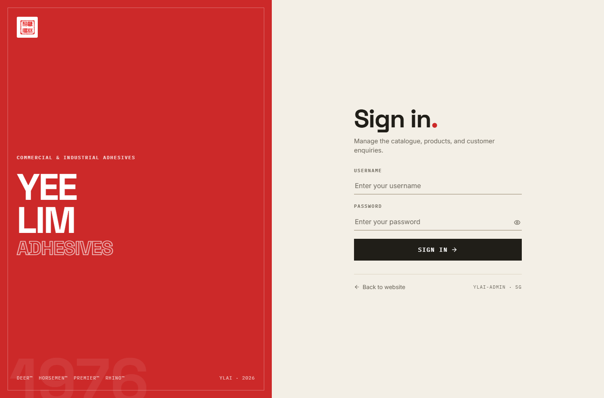
*Screenshot 1. The admin sign in page. Fields shown empty, no credentials displayed.*

**Note.** After ten failed sign in attempts from the same internet connection within
fifteen minutes, the login is temporarily blocked and tells you how long to wait.
A successful sign in clears the block immediately. *(Verified from code)*

Your sign in lasts for **24 hours**, after which you will be asked to sign in again.
*(Verified from code)*

## 2.2 How to log out

Select the **sign out** icon at the bottom left of the admin sidebar, next to your
username. Always sign out on a shared or public computer.

## 2.3 First actions after handover

1. Change the admin password. See [06_SECURITY_AND_ACCESS_GUIDE.md](06_SECURITY_AND_ACCESS_GUIDE.md).
   `[DEVELOPER TO VERIFY]` The admin portal has no self service password change
   screen in the current build, so a developer performs the change.
2. Confirm the contact email, WhatsApp number, phone number and address in
   **Admin, Site Settings** are correct.
3. Send one test enquiry from the public site and confirm it appears in
   **Admin, Enquiries** and that the notification email arrives. See section 9.5.
4. Take a first backup of the website files and the database. See section 18.
5. Record who owns the hosting, domain and admin accounts, using
   [09_CREDENTIALS_TRANSFER_TEMPLATE.md](09_CREDENTIALS_TRANSFER_TEMPLATE.md).

---

# 3. Website Overview

## 3.1 Website goals

1. Present the Yee Lim range clearly and truthfully, without inventing claims.
2. Help a trade buyer narrow a wide catalogue down to the right product quickly.
3. Turn that into a qualified enquiry that reaches the Yee Lim team by email and is
   also stored permanently in the admin inbox.
4. Give staff full control of the catalogue without needing a developer.

## 3.2 Target audience

Business to business buyers and specifiers. The site deliberately avoids retail
language. It shows availability and directs pricing to an enquiry.

## 3.3 Main public pages

| Page | Address | Owned by |
| --- | --- | --- |
| Home | `/` | Maintained directly on the live server, outside this project. See section 4.1. |
| About | `/about` | Maintained directly on the live server, outside this project. See section 4.2. |
| Products (catalogue) | `/products` | Project ReBond |
| Product Detail | `/product-detail?id=<number>` | Project ReBond |
| Compare | `/compare` | Project ReBond |
| Product Enquiry | `/enquiry` | Project ReBond |
| Contact | `/contact` | Project ReBond |
| Page not found | `/404.html`, shown automatically for unknown addresses | Project ReBond |

*(Verified from code. Clean addresses such as `/products` are produced by the server
configuration file `frontend/.htaccess`; a visitor who types `/products.html` is
redirected to `/products`.)*

## 3.4 The main customer journey

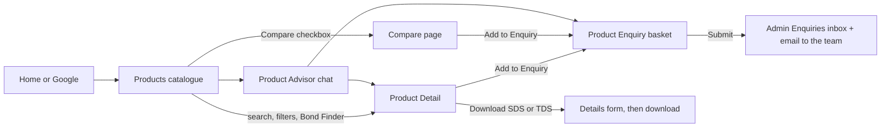
```mermaid
flowchart LR
  A[Home or Google] --> B[Products catalogue]
  B -->|search, filters, Bond Finder| C[Product Detail]
  C -->|Add to Enquiry| E[Product Enquiry basket]
  B -->|Compare checkbox| D[Compare page]
  D -->|Add to Enquiry| E
  C -->|Download SDS or TDS| F[Details form, then download]
  E -->|Submit| G[Admin Enquiries inbox + email to the team]
  B --> H[Product Advisor chat]
  H --> C
  H --> E
```

## 3.5 How Products, Compare, Enquiry and Contact work together

- The **Products** page is the entry point. Every product card can be added to the
  enquiry basket or ticked for comparison.
- **Compare** holds up to **three** products and lays their recorded data side by side.
- The **Product Enquiry** basket is the shared destination. A visitor can add products
  from the catalogue, from a product detail page, from the compare table or from the
  Product Advisor, then send one enquiry covering all of them.
- **Contact** is for visitors who prefer to phone, use WhatsApp, or visit in person.
  It is information only; there is no form on the Contact page in the current build.
  *(Verified from code)*

The basket and the compare selection are stored in the visitor's own browser, so they
survive moving between pages and closing the tab. They are not stored on the server
until the enquiry is actually submitted. *(Verified from code)*

---

# 4. Public Website Walkthrough

## 4.1 Home page

**Important.** The Home page is **not** part of the Project ReBond source code. It is
maintained directly on the live server by a separate contributor, and the deployment
scripts used by this project are hard coded to refuse to upload it.
*(Verified from code, `deploy_all.sh` and `deploy_rebond_public.sh` both list
`index.html` in a "NEVER" guard.)*

| Item | Detail |
| --- | --- |
| What visitors see | `[CLIENT TO CONFIRM]` The live Home page content is outside this documentation's scope. |
| Client controlled content | `[CLIENT TO CONFIRM]` |
| What must not be changed | Do not deploy a Home page from this project's repository over the live one. It would replace the real page with an empty file. |

## 4.2 About page

The same applies to the About page. The copy of `about.html` inside this project is
**empty** and exists only as a placeholder; the real page lives on the live server.
*(Verified from code, `frontend/about.html` is 0 bytes.)*

Do not deploy this project's `about.html`.

## 4.3 Products page (the catalogue)

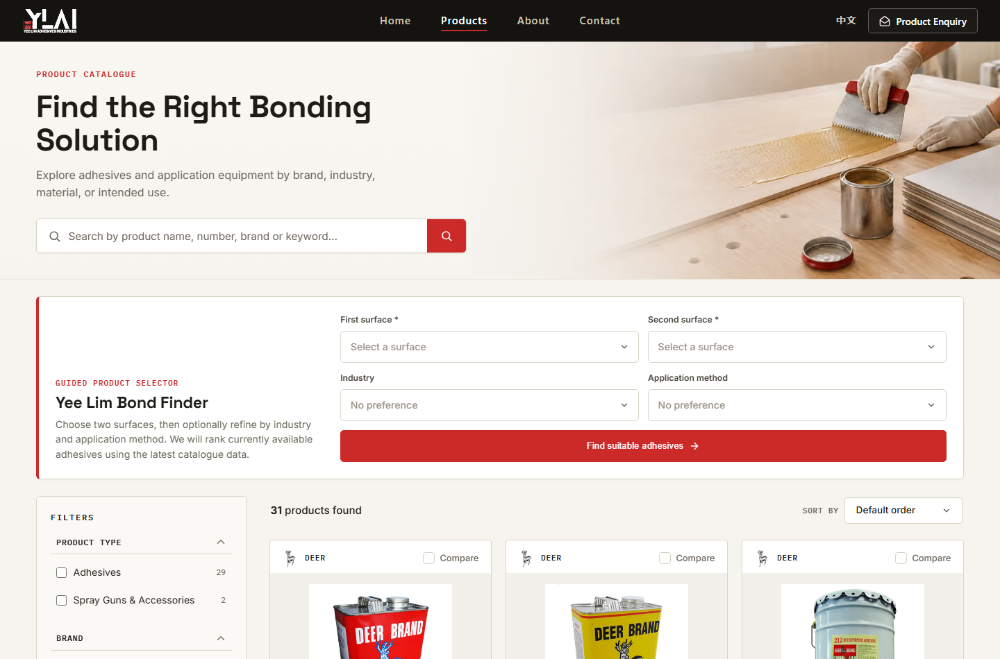
*Screenshot 2. The Products catalogue on a desktop screen.*

**Purpose.** The main catalogue. Everything a visitor needs to find a product.

**What visitors see and can do:**

| Area | Behaviour |
| --- | --- |
| Hero and search bar | Free text search across product name, brand, category, descriptions, application text, industries, surfaces and features. Pressing Enter scrolls down to the results. |
| **Yee Lim Bond Finder** | A guided selector. The visitor chooses a first surface and a second surface (both required), and may narrow further by industry and application method. The site then ranks currently available adhesives from the live catalogue and shows a match percentage. It also offers a WhatsApp button pre-filled with the visitor's selections. |
| Filter sidebar | Four groups: **Product Type**, **Brand**, **Industry**, **Surface / Material**. Each shows how many products match. |
| Active filters | Selected filters appear as removable chips with a **Clear all** control. |
| Sort | Default order, Name A to Z, Name Z to A, Sort by Brand. |
| Product cards | Brand mark, photo, name, short description, a **Compare** tick box and an **Add to Enquiry** action. The whole card is clickable through to the product detail page. |
| Product Advisor | Opens the "Ava" chat panel. See section 11. |

**Data shown.** All product data on this page comes from the database and is managed
in **Admin, Products**. Nothing on a product card is hard coded.

**Client controlled content on this page:** every product name, brand, short
description, image, industry, surface and product type, plus the filter values
themselves (**Admin, Catalogue Filters**).

**Mobile behaviour.** Filters move into a bottom sheet opened by a **Filters** button.
Cards render two per row. See section 15.

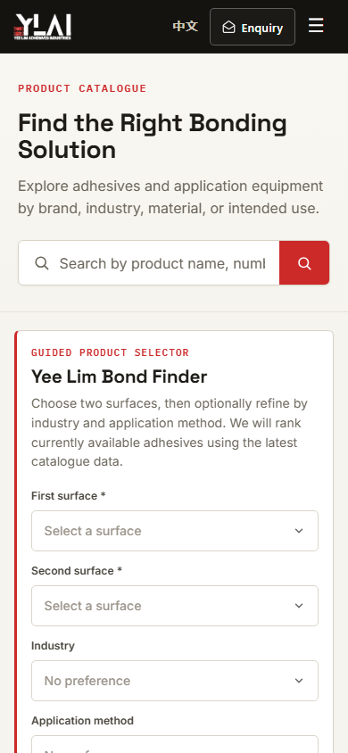
*Screenshot 3. The Products catalogue on a mobile screen.*

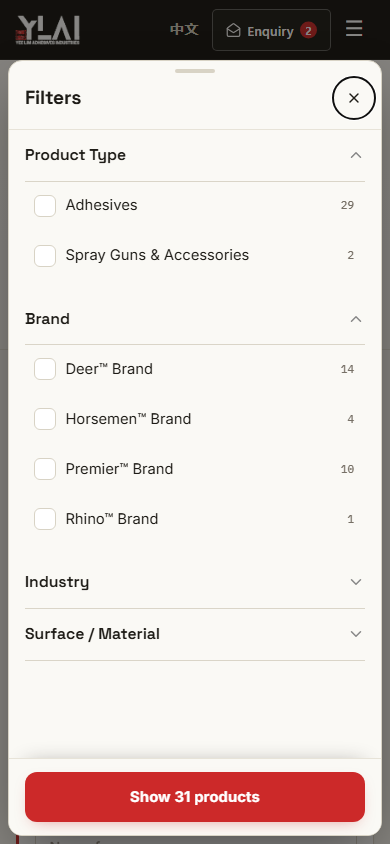
*Screenshot 4. The mobile filter sheet.*

**Common problems.** A new product not appearing is almost always a browser cache
issue or an unsaved record. See [07_TROUBLESHOOTING_GUIDE.md](07_TROUBLESHOOTING_GUIDE.md).

**Do not change without developer support:** the page layout, the filter logic, the
Bond Finder scoring, or the search behaviour.

## 4.4 Product Detail page

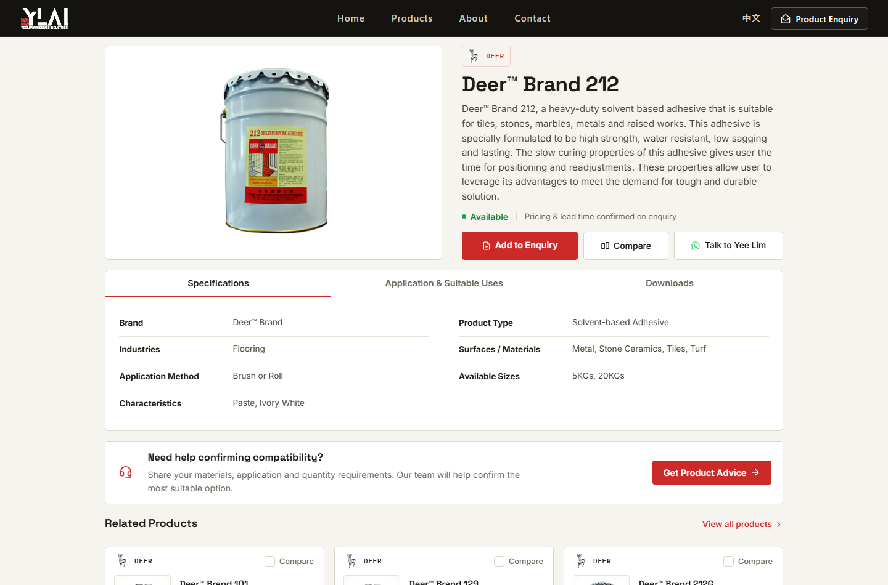
*Screenshot 5. A product detail page on desktop.*

**Purpose.** Everything known about one product, plus the two calls to action
(add to enquiry, talk to Yee Lim).

**Layout:**

| Area | Content |
| --- | --- |
| Image gallery | The main image plus any additional images, with thumbnails. |
| Summary | Product name, brand, short description, availability. |
| Availability wording | `Available` with the line `Pricing & lead time confirmed on enquiry`. This wording is approved and must not be changed to "In stock". *(Project decision, verified from code)* |
| Actions | **Add to Enquiry**, **Compare**, and a WhatsApp action. |
| Tab 1, Specifications | A two column table built only from real recorded data: Brand, Product Type, Industries, Surfaces / Materials, Application Method, Available Sizes, Characteristics. Rows with no data are hidden rather than shown empty. |
| Tab 2, Application & Suitable Uses | The "How to Use" text and the "Suitable for" list. |
| Tab 3, Downloads | Safety Data Sheet and Technical Data Sheet, when uploaded. Always visible, with an honest empty state when there is nothing to download. |
| Related Products | Other products from the catalogue. |

**Where Application Method and Available Sizes come from.** They are **not** separate
fields. They are read out of the **Features** field, using two recognised patterns:
a feature written as `Application: Brush or Roll` becomes the "Application Method"
row, and a feature written as `Available in 300G, 1 US Gallon` becomes the "Available
Sizes" row. Everything else in Features becomes the "Characteristics" row.
*(Verified from code.)* This matters when you edit products, see section 6.

**Mobile behaviour.** The three tabs become an accordion, and a persistent action bar
sits at the bottom of the screen. See section 15.

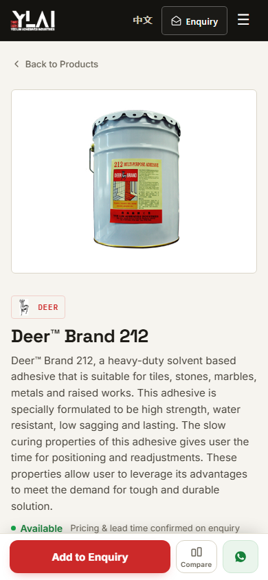
*Screenshot 6. A product detail page on mobile.*

## 4.5 Compare page

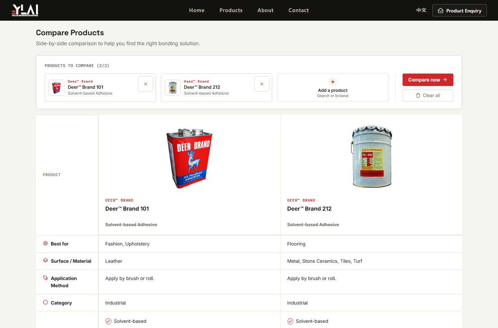
*Screenshot 7. The compare table on desktop.*

See section 10 for the full description.

## 4.6 Product Enquiry page

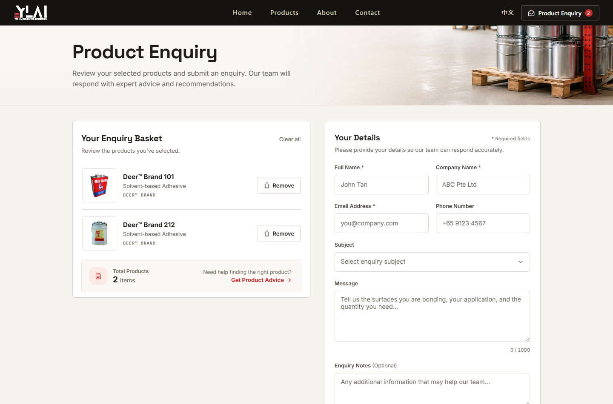
*Screenshot 8. The Product Enquiry page with two products in the basket.*

**Purpose.** Review the selected products and send one enquiry.

**Fields on the form** *(Verified from code)*:

| Field | Required | Notes |
| --- | --- | --- |
| Full Name | Yes | |
| Company Name | Yes | |
| Email Address | Yes | Must be a valid email address. |
| Phone Number | No | |
| Subject | No | Choice of: General product enquiry, Request a quotation, Technical / application advice, Bulk or distributor enquiry, Other. |
| Message | No | Up to 1000 characters. |
| Enquiry Notes | No | Up to 1000 characters. |
| Privacy agreement tick box | Yes | The visitor must agree before the enquiry can be sent. |

There is also a hidden field that visitors never see. It exists to catch automated
spam and should be ignored. *(Verified from code)*

**What happens on submit:**

1. The enquiry is **saved to the database first**. This is the permanent record.
2. A notification email is then attempted to the Yee Lim team.
3. A confirmation email is attempted to the customer, including their reference number.

Steps 2 and 3 are best effort. If email fails, **the enquiry is still saved** and
still appears in the admin inbox. *(Verified from code)*

The visitor is shown a reference number in the form `YL-2026-0042`.

## 4.7 Contact page

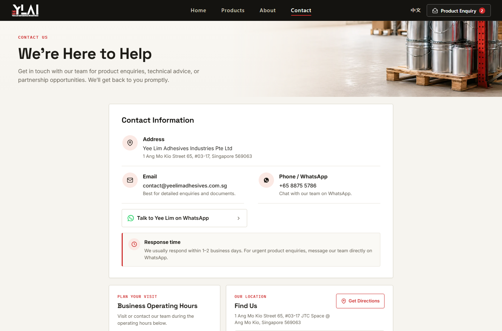
*Screenshot 9. The Contact page.*

**Purpose.** Direct contact details. There is no contact form on this page in the
current build; enquiries are handled through the Product Enquiry page.
*(Verified from code)*

| Area | Content | Where it is edited |
| --- | --- | --- |
| Address | Yee Lim Adhesives Industries Pte Ltd, 1 Ang Mo Kio Street 65, #03-17, Singapore 569063 | **Admin, Site Settings** |
| Email | A "contact us by email" link | **Admin, Site Settings** |
| Phone / WhatsApp | +65 8875 5786 | **Admin, Site Settings** |
| WhatsApp button | Opens a WhatsApp chat | Number comes from **Admin, Site Settings** |
| Response time note | "We usually respond within 1 to 2 business days." | In the page code, a developer change |
| Business operating hours | Monday to Friday 8:00 AM to 5:00 PM, Saturday 8:00 AM to 12:00 PM, Sunday closed, public holidays may vary | In the page code, a developer change |
| Map and Get Directions | An embedded map of the JTC Space @ Ang Mo Kio address | In the page code, a developer change |

## 4.8 Page not found (404)

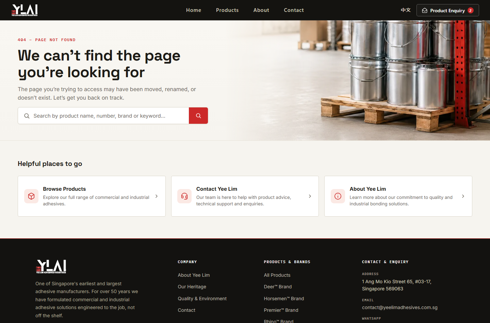
*Screenshot 10. The page not found screen.*

Shown automatically when a visitor requests an address that does not exist. It fits
on one screen and offers a route back to the catalogue. No client controlled content.

---

# 5. Admin Portal Overview

## 5.1 Access

The admin portal is at the live site address followed by `/admin/login.html`. It is
protected by a username and password. There is no public link to it from the site.

## 5.2 Dashboard (Overview)

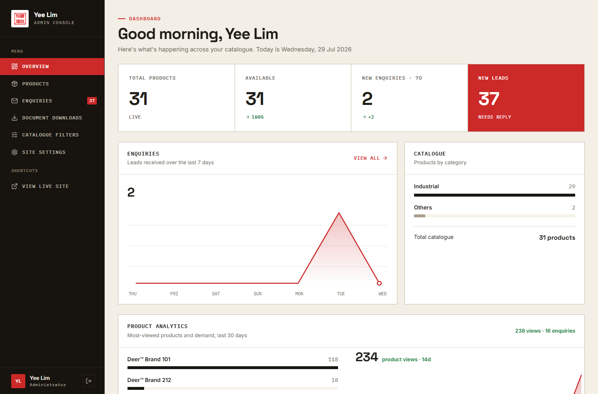
*Screenshot 11. The admin dashboard. Test data shown.*

The dashboard shows:

- Total products, and how many are Available.
- New enquiries in the last 7 days, and how many still need a reply.
- A 7 day enquiry chart.
- Catalogue breakdown by category.
- **Product Analytics**: most viewed products and a view trend over the last 30 days,
  taken from the site's own view counter. Views by logged in admins are excluded.
  *(Verified from code)*

## 5.3 The admin menu

| Menu item | What it does | Section |
| --- | --- | --- |
| **Overview** | Dashboard summary | 5.2 |
| **Products** | Add, edit, delete products; upload images and documents | 6, 7, 8 |
| **Enquiries** | Review and manage customer enquiries | 9 |
| **Document Downloads** | Who requested an SDS or TDS | 8.6 |
| **Catalogue Filters** | Add, rename, reorder, hide or archive Product Types, Brands, Industries and Surfaces | 6.9 |
| **Site Settings** | Contact email, WhatsApp number, phone display, address, enquiry recipient email | 14.4 |
| **View Live Site** | Opens the public catalogue | |

## 5.4 Logout

Use the sign out icon beside your username at the bottom of the sidebar. Signing out
ends the session immediately on the server. *(Verified from code)*

## 5.5 Roles and access

The current build has **one level of access**. Every person who signs in has full
admin rights: they can edit and delete any product, and read and delete any enquiry.
There are no read only or limited accounts. *(Verified from code)*

**Recommendation.** Because there are no roles, give the admin login only to staff who
genuinely need it, and treat every account as a full administrator. See
[06_SECURITY_AND_ACCESS_GUIDE.md](06_SECURITY_AND_ACCESS_GUIDE.md).

---

# 6. Managing Products

Step by step instructions with expected results are in
[02_ADMIN_USER_GUIDE.md](02_ADMIN_USER_GUIDE.md). This section explains what each
field means and the rules that apply to it.

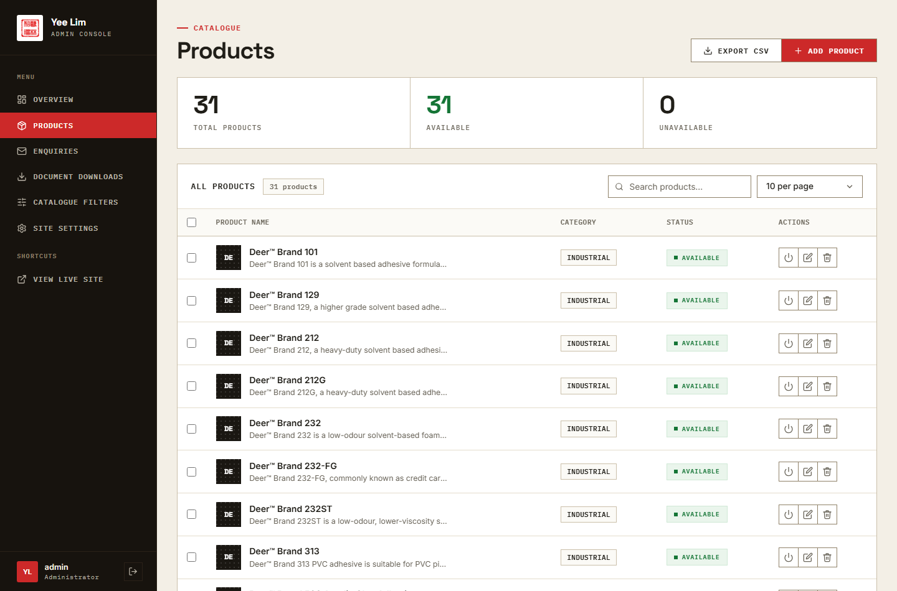
*Screenshot 12. The Products list in the admin portal.*

## 6.1 The product form

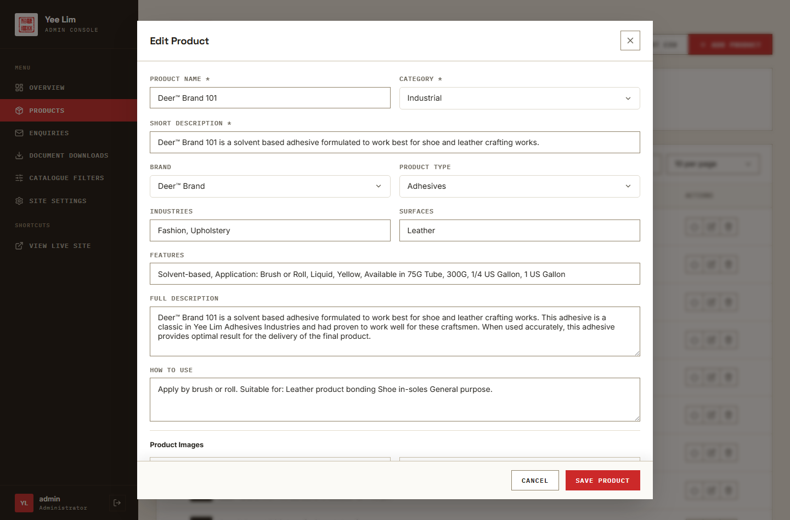
*Screenshot 13. The Edit Product form.*

These are the **only** fields the form has. *(Verified from code)*

| Field | Required | Type | Notes |
| --- | --- | --- | --- |
| **Product Name** | Yes | Text, maximum 200 characters | Rejected if empty or too long. |
| **Category** | Yes | Choice | Industrial, Commercial, Others. |
| **Short Description** | Yes | Single line, maximum 5000 characters | Appears on the product card and at the top of the detail page. |
| **Brand** | No | Choice | Deer™ Brand, Horsemen™ Brand, Premier™ Brand, Rhino™ Brand, Others & Accessories. |
| **Product Type** | No | Choice | Adhesives, Spray Guns & Accessories. If left blank, the system assigns "Spray Guns & Accessories" when the brand is "Others & Accessories" or the category is "Others", otherwise "Adhesives". |
| **Industries** | No | Comma separated list | For example `Carpentry, Flooring`. Drives the Industry filter. |
| **Surfaces** | No | Comma separated list | For example `Wood, Laminates`. Drives the Surface / Material filter. |
| **Features** | No | Comma separated list | See 6.2. This one field feeds three different rows on the public page. |
| **Full Description** | No | Multi line | The longer description on the detail page. |
| **How to Use** | No | Multi line | Application instructions and the "Suitable for" list. |
| **Main Product Image** | No | Image upload | See section 7. |
| **Additional Product Images** | No | Image upload | See section 7. |
| **Safety Data Sheet** | No | PDF upload | See section 8. |
| **Technical Data Sheet** | No | PDF upload | See section 8. |

### Fields the form does not have

To avoid confusion, note that the following do **not** exist as separate fields:

- There is **no** "Available Sizes" field. Sizes are entered inside **Features**, see 6.2.
- There is **no** "Application Method" field. It is entered inside **Features**, see 6.2.
- There is **no** "Suitable Uses" field. Suitable uses are written inside **How to Use**, see 6.4.
- There is **no** "Key Benefits" field. Product characteristics go in **Features**, see 6.2.
- There is **no** Status control **inside** the form. Status is changed from the product
  list, see 6.5.

## 6.2 How the Features field works (important)

**Features** is one comma separated list, but the public product page splits it into
three different rows: *(Verified from code)*

| What you type | Where it appears publicly |
| --- | --- |
| `Application: Brush or Roll` | The **Application Method** row of the specification table |
| `Available in 300G, 1/4 US Gallon, 1 US Gallon` | The **Available Sizes** row |
| `Solvent-based` or `Water-based` | Hidden, because the Product Type row already says this |
| Anything else, for example `Liquid, Yellow, Low VOC` | The **Characteristics** row |

**Worked example.** A real catalogue record reads:

```
Solvent-based, Application: Brush or Roll, Liquid, Yellow, Available in 75G Tube, 300G, 1/4 US Gallon, 1 US Gallon
```

which the public page renders as:

- Application Method: Brush or Roll
- Available Sizes: 75G Tube, 300G, 1/4 US Gallon, 1 US Gallon
- Characteristics: Liquid, Yellow

> **Warning.** Keep the exact prefixes `Application:` and `Available in `. If you write
> "Applied by brush" or "Sizes: 300G" instead, the text will fall into the general
> Characteristics row rather than its own labelled row.

## 6.3 Choosing the correct brand

Use the official brand names exactly as they appear in the list, including the
trademark mark: `Deer™ Brand`, `Horsemen™ Brand`, `Premier™ Brand`, `Rhino™ Brand`.

`Others & Accessories` is used for spray guns and non adhesive items. It is
deliberately hidden from the public Brand filter, but products assigned to it still
appear in the catalogue under the "Spray Guns & Accessories" product type.
*(Verified from code)*

## 6.4 Suitable uses and How to Use

Write the application instructions first, then the suitable uses list. The public
page looks for a `Suitable for:` marker.

> **Known data issue.** Some existing records lost the separators between the items in
> their "Suitable for" list, so the list can read as one run on sentence, for example
> "Leather product bonding Shoe in-soles General purpose." The site deliberately does
> **not** guess where to split, because guessing would invent product claims.
> When you edit a product, separate the uses clearly with semicolons or commas.
> *(Verified from code and project notes.)*

Recommended format:

```
Apply by brush or roll.
Suitable for: Leather product bonding; Shoe in-soles; General purpose.
```

## 6.5 Product status

Status is either **Available** or **Unavailable**. It is **not** in the edit form.
You change it from the product list in one of two ways:

- Select the status toggle icon on the product's row, or
- Tick several products and use **Mark Available** / **Mark Unavailable** in the bulk bar.

A new product is created as **Available**. *(Verified from code)*

An Unavailable product still appears in the catalogue, but is labelled Unavailable,
and the Product Advisor will explicitly say it is currently unavailable rather than
recommending it as if it were in stock. *(Verified from code)*

## 6.6 Adding a product

Full steps are in [02_ADMIN_USER_GUIDE.md](02_ADMIN_USER_GUIDE.md), section 3.
In summary: **Products**, **Add Product**, fill in at least Product Name, Category and
Short Description, attach images and documents, then **Save Product**.

## 6.7 Editing a product

**Products**, find the row, select the edit icon, change what you need, **Save Product**.
Changes appear on the public site immediately, subject to browser caching.

## 6.8 Deleting or deactivating a product

> **Warning.** Deleting a product is permanent. It also permanently deletes that
> product's uploaded images and documents from the server. *(Verified from code)*

**In almost every case, mark the product Unavailable instead of deleting it.**
That keeps the record, the photos, the documents and the history.

Delete only when a product was created in error. A confirmation dialog appears first.

## 6.9 Categories, industries, surfaces and product types

Two different things control these:

1. **What a product is tagged with**: the Industries, Surfaces, Category and Product
   Type fields on the product form.
2. **Which values are offered and how they appear in the public sidebar**: the
   **Catalogue Filters** page.

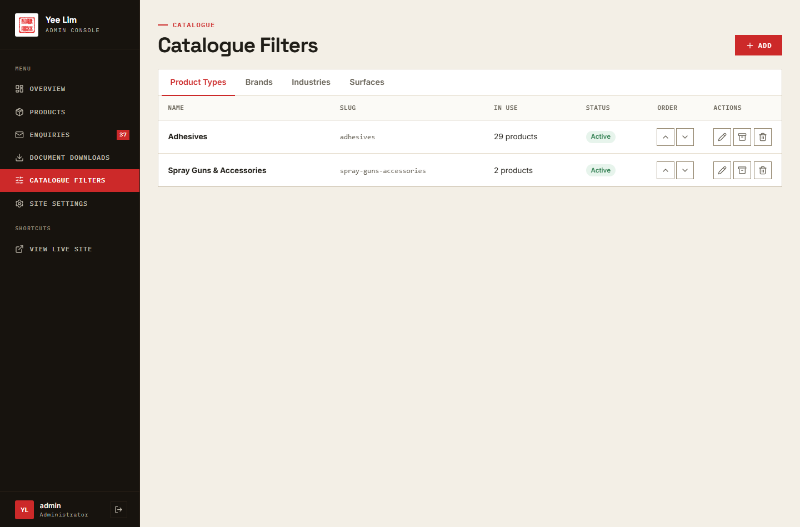
*Screenshot 14. The Catalogue Filters admin page.*

On **Catalogue Filters** you can, per group (Product Types, Brands, Industries, Surfaces):

- Add a new value.
- Rename a value. Renaming also updates every product that used the old name, in one
  step, so the catalogue never silently loses a filter value. *(Verified from code)*
- Change the display order.
- Hide a value from the public sidebar while still allowing it to be assigned.
- Archive a value so it disappears everywhere without touching product records.
- Delete a value, but only if no product is using it. If a product is using it, the
  system refuses and tells you. *(Verified from code)*
- For brands only: set a logo image path and its alternative text.

## 6.10 Checking the public page after saving

Always do this. Open the public product page in a new tab and confirm:

- The name, brand and description read correctly.
- The image appears.
- The specification rows are populated as you expected, in particular Application
  Method and Available Sizes.
- The Downloads tab shows the documents you uploaded.
- The product appears under the filters you tagged it with.

If a change does not show, do a hard refresh first (`Ctrl` + `F5` on Windows,
`Cmd` + `Shift` + `R` on a Mac).

---

# 7. Managing Product Images

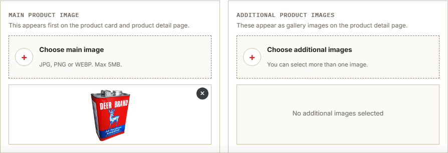
*Screenshot 15. The Product Images area of the product form.*

> **Protected component.** The image upload and document upload areas of the product
> form were built by a separate contributor and are live on the production server.
> They must be preserved as they are. A future developer should replace them only
> deliberately, after taking a backup and testing. See section 22 and
> [03_TECHNICAL_HANDOVER.md](03_TECHNICAL_HANDOVER.md).

## 7.1 Accepted formats and size limit

*(Verified from code, `frontend/api/upload-product-images.php`)*

| Rule | Value |
| --- | --- |
| Accepted formats | JPG, PNG, WEBP |
| Maximum size | 5 MB per image |
| How the format is checked | By inspecting the actual file content, not just the file name |

An unsupported file is rejected with "Only JPG, PNG and WEBP images are allowed."
An oversized file is rejected with "Each image must be below 5MB."

## 7.2 Recommended dimensions

`[DEVELOPER TO VERIFY]` The code does not enforce or resize to any particular pixel
size, so no dimension is asserted here as a rule.

*(Recommendation)* Use square or near square product photographs, roughly 1200 by 1200
pixels, on a plain light background, and keep each file under about 500 KB so pages
load quickly on a mobile connection.

## 7.3 Main image

The **Main Product Image** is the photo shown on the product card in the catalogue and
first in the gallery on the detail page. Upload one file.

## 7.4 Additional images

**Additional Product Images** become the rest of the gallery on the detail page. You
can select several files at once.

## 7.5 Image order

The main image is always first, followed by the additional images in the order they
were uploaded. There is no drag to reorder control in the current build.
*(Verified from code)*

To change the order, re upload the images in the order you want.

## 7.6 Alternative text

The form has **no alternative text field** for product images. The site uses the
product name as the image description. *(Verified from code)*

*(Recommendation)* If accessibility of product photos becomes a requirement, ask a
developer to add a per image description field.

## 7.7 Replacing an image

Upload a new main image. It replaces the one currently shown. Old files remain on the
server until the product itself is deleted.

## 7.8 Deleting an image

There is no per image delete control in the current build. Images are removed
automatically when the whole product is deleted. *(Verified from code)*
To remove a single gallery image, ask a developer.

## 7.9 Checking mobile display

After uploading, open the product on a phone, or narrow your browser window, and check
the photo is not cropped awkwardly on the product card.

## 7.10 What happens if no image is uploaded

The product still works. The card and the detail gallery show a neutral placeholder
rather than a broken image. This is intentional: some catalogue items genuinely have
no photograph. *(Verified from code, project decision)*

---

# 8. Managing SDS and TDS Documents

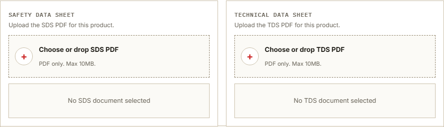
*Screenshot 16. The Product Documents area of the product form.*

## 8.1 The difference between SDS and TDS

| Document | Full name | Purpose |
| --- | --- | --- |
| **SDS** | Safety Data Sheet | Hazard, handling, storage, first aid and disposal information. Usually a legal and workplace safety requirement. |
| **TDS** | Technical Data Sheet | Technical performance data: coverage, drying time, physical properties, application conditions. |

## 8.2 Where each document appears

Both appear on the product detail page under the **Downloads** tab. The Downloads tab
is always visible. When a product has no documents it shows an honest empty state
("No downloads are currently available for this product") rather than being hidden.
*(Verified from code)*

## 8.3 Accepted file types

*(Verified from code, `frontend/api/upload_product_document.php`)*

| Rule | Value |
| --- | --- |
| Accepted format | PDF only |
| Maximum size | 10 MB |
| How the format is checked | By inspecting the actual file content. A file renamed to `.pdf` that is not really a PDF is rejected. |

## 8.4 One document per type

Uploading a new SDS **replaces** the existing SDS for that product, and the old file is
deleted from the server. The same applies to the TDS. *(Verified from code)*

You do not need to delete the old one first.

## 8.5 Naming convention

The file you upload keeps its original name for display, and the customer's download
is named after it, cleaned of unusual characters. The file is stored on the server
under an internal random name for security. *(Verified from code)*

*(Recommendation)* Name your source files consistently before uploading, for example
`Deer-Brand-101-SDS-2026-03.pdf`, so the version and date are obvious to the customer.

## 8.6 How customers download a document, and what you can see

Downloads are **gated**. A visitor cannot reach the PDF file directly.

1. The visitor selects the SDS or TDS on the product page.
2. A form asks for their name, work email, company (all required) and phone (optional),
   with a privacy notice.
3. The site records the request, then issues a **single use link that expires after
   about 15 minutes**, and the download starts.
4. The record appears in **Admin, Document Downloads**.

*(Verified from code, `api/document_request.php` and `api/download_document.php`.)*

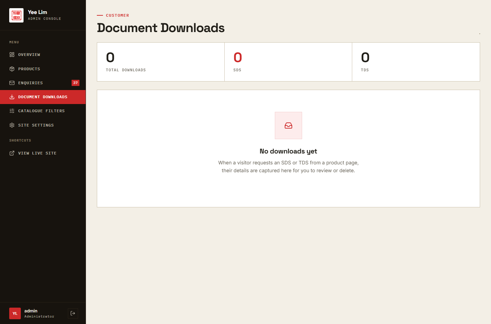
*Screenshot 17. The Document Downloads page, shown with no records.*

The Document Downloads page lists the visitor's name, contact details, the product,
the document type and the date, and lets you delete records individually or in bulk.
**This data is never emailed out.** It is visible only inside the admin portal.
*(Project decision, verified from code)*

## 8.7 Replacing an outdated document

Open the product, upload the replacement PDF into the SDS or TDS slot, save. Confirm
on the public page that the Downloads tab now offers the new file.

## 8.8 Verifying links

After any document change, open the public product page, complete the download form
with your own details, and confirm the correct PDF downloads. Then delete your own
test record from **Document Downloads** if you prefer.

## 8.9 Document ownership and approval

`[CLIENT TO CONFIRM]` Yee Lim owns the content of every SDS and TDS. Decide internally
who signs off a data sheet before it is published, and record it in
[10_CHANGE_LOG_TEMPLATE.md](10_CHANGE_LOG_TEMPLATE.md). The website performs no
technical or regulatory review of the document you upload.

---

# 9. Managing Enquiries

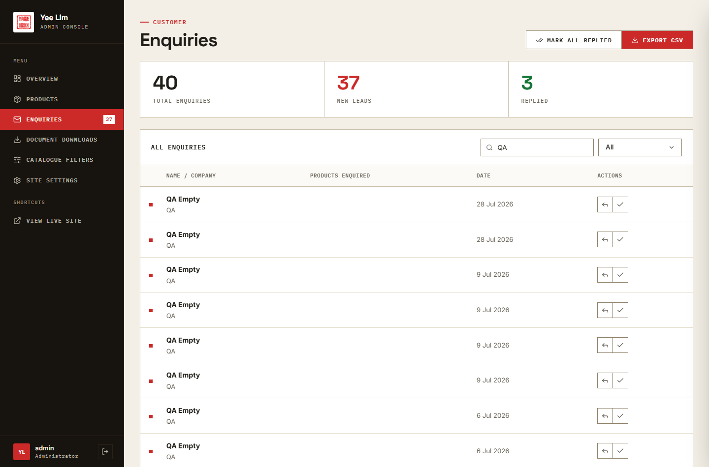
*Screenshot 18. The Enquiries inbox, filtered to test records only.*

## 9.1 How visitors build an enquiry

A visitor selects **Add to Enquiry** on a product card, a product detail page, the
compare table or from the Product Advisor. The count in the site header updates. Their
selection is stored in their own browser until they submit.

## 9.2 How the enquiry is submitted

On the **Product Enquiry** page the visitor reviews the basket, fills in the form
(section 4.6) and submits. They immediately see a reference number.

## 9.3 Reference numbers

Every enquiry has a reference in the form `YL-<year>-<four digits>`, for example
`YL-2026-0042`. It is shown to the customer, included in both emails, and shown in the
admin inbox. *(Verified from code)*

## 9.4 Where staff review enquiries

**Admin, Enquiries.** The list shows total enquiries, new leads and replied counts,
and is searchable and filterable by status. Selecting a row opens a side panel with
the full enquiry, including the products enquired about.

## 9.5 Status handling and the reply workflow

There are exactly two states: **New** (needs a response) and **Replied**.
*(Verified from code)*

You can mark an enquiry as replied in three ways:

1. From the row, using the tick action.
2. From the enquiry detail panel, using **Mark as Replied**.
3. **Directly from the notification email.** The email contains a one tap link that
   marks the enquiry as replied without signing in. *(Verified from code)*

There is also a **Mark all replied** action for clearing a backlog.

**To reply to the customer**, use **Reply by Email**, which opens your email program
addressed to the customer. Replying directly to the notification email also works,
because it is set to reply to the customer's address. *(Verified from code)*

## 9.6 Exporting enquiries

**Export CSV** on the Enquiries page downloads the list as a spreadsheet file.
*(Verified from code)*

> **Warning.** The exported file contains customer personal data. Store it
> appropriately and do not email it outside the company.

## 9.7 Spam and test enquiries

Two invisible protections are already in place, with no CAPTCHA for genuine visitors:

- A hidden field that automated spam tools fill in and real visitors never see. When
  it is filled, the site pretends to succeed but saves nothing and emails no one.
- A rate limit of five enquiries per ten minutes from the same internet connection.

*(Verified from code)*

Enquiries created during testing should be deleted once they are no longer needed, so
the "New leads" count stays meaningful.

## 9.8 Safe deletion and record retention

Deleting an enquiry is permanent and cannot be undone. *(Verified from code)*

*(Recommendation)* Agree a retention period internally, for example keep enquiries for
24 months and then delete. `[CLIENT TO CONFIRM]` Confirm this against your own privacy
obligations. Export to CSV before any bulk deletion.

---

# 10. Product Compare

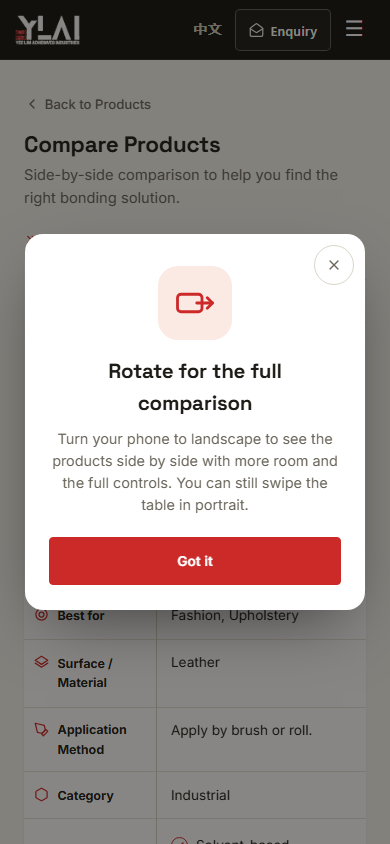
*Screenshot 19. The compare experience on mobile.*

| Question | Answer |
| --- | --- |
| Maximum number of products | **Three.** *(Verified from code)* |
| How to add | Tick **Compare** on a product card, or use the Compare action on a product detail page. |
| How to remove | Untick the card, remove from the compare tray, or clear the whole selection. |
| What happens when full | The site tells the visitor compare is full and that one must be removed first. |
| Where the selection is stored | In the visitor's own browser. It survives page changes and closing the tab. |

**Desktop behaviour.** A compare tray sits at the bottom of the catalogue showing the
current selection and a count, for example `(2/3)`. Selecting **Compare now** opens the
comparison table.

**Mobile behaviour.** The tray becomes a side tab and a bottom sheet. A product picker
with search lets the visitor add products without leaving the compare view.

**What is compared.** Only recorded product data: name, brand, availability, product
type, industries, surfaces, materials and the recorded characteristics. Nothing is
invented to fill a gap, so different products legitimately show different rows.

**Limitations to be aware of:**

- Three products maximum.
- Prices are never compared, because the site does not hold prices.
- A product with sparse data will show blank cells. That is intentional and truthful;
  the fix is to complete the product record, not to change the compare page.
- The compare page carries a disclaimer that the comparison is guidance and that
  suitability should be confirmed with Yee Lim.

---

# 11. Product Advisor

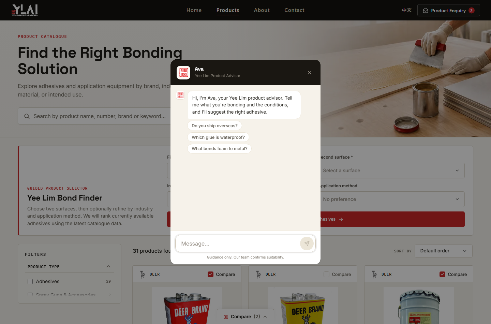
*Screenshot 20. The Product Advisor panel, "Ava".*

## 11.1 What it does

The Product Advisor is a chat panel, presented as "Ava", opened from a button on the
Products page. A visitor describes what they are bonding and the conditions, and it
suggests products **from the live Yee Lim catalogue**, with links to those product
pages and to the enquiry form.

It also answers common company questions: address, contact details, delivery, lead
times, export, custom formulation, company background, Green Label products, and how
to order. *(Verified from code)*

## 11.2 How it works, honestly

The advisor has **two modes**, and which one is active depends on server configuration:

| Mode | When it is used | Behaviour |
| --- | --- | --- |
| **AI mode** | When an AI provider and key are configured on the server | The question, the conversation history and a summary of the real catalogue are sent to a hosted AI service, which writes the reply. |
| **Catalogue matcher mode** | When no AI provider is configured, or the AI call fails | A built in rule based matcher scores products against the visitor's words and returns the best three. It is not conversational, but it always answers. |

*(Verified from code, `frontend/api/advisor.php`.)*

`[DEVELOPER TO VERIFY]` Which mode the **live** site is currently running depends on
the server configuration file, which is deliberately not stored in this repository and
was not inspected while preparing this pack. Confirm with the developer before
describing the feature as "AI" in any marketing material.

**In both modes:** the AI service, if used, is contacted from the Yee Lim server, never
from the visitor's browser, so no key is ever exposed to the public.
*(Verified from code)*

## 11.3 What information it uses

Only the product catalogue in the Yee Lim database (name, brand, category, short
description, application text, industries, surfaces, features and availability), plus
a fixed set of company facts written into the code. It has no access to enquiries,
customer records, or prices. *(Verified from code)*

## 11.4 Disclaimer

The panel carries the line **"Guidance only. Our team confirms suitability."** and the
advisor routinely directs visitors to submit an enquiry for pricing, minimum order
quantity and lead time. This wording should be kept.

## 11.5 What it cannot guarantee

- It cannot quote a price, a minimum order quantity or a lead time.
- It cannot confirm regulatory or safety suitability for a specific job.
- It does not know stock levels beyond the Available or Unavailable flag.
- In AI mode, wording is generated and may occasionally be imprecise. The catalogue
  data it draws on is real, but the phrasing around it is not reviewed in advance.

## 11.6 When visitors should contact Yee Lim directly

Whenever the job involves a safety critical bond, an unusual substrate, a regulatory
requirement, a large volume, or a custom formulation. The advisor itself says so and
offers the enquiry link and the WhatsApp number.

## 11.7 The Bond Finder is a different, separate feature

Do not confuse the two. The **Yee Lim Bond Finder** on the Products page is a plain
form: choose two surfaces, optionally an industry and an application method, and the
site ranks matching available products by a fixed scoring rule. It involves no AI at
all. It carries its own disclaimer: "Catalogue matches are guidance only. Confirm
final suitability, surface preparation and operating conditions with Yee Lim before
purchase or large scale use." *(Verified from code)*

---

# 12. Search, Filters and Sorting

## 12.1 Search behaviour

*(Verified from code)*

- Search matches the **start of a word**, not any letters anywhere. Typing `pre` finds
  "Premier", but typing `a` does not match every product containing the letter A.
- A **single letter** query searches only the product **name and brand**, so one letter
  jumps quickly to a product or a brand.
- **Two or more letters** search every field: name, brand, category, short and full
  descriptions, application text, industries, surfaces and features.
- Pressing Enter applies the search and scrolls down to the results.

**This is why your product wording matters.** A customer searching for "waterproof"
will only find a product if that word appears somewhere in its recorded data. See
[04_CONTENT_AND_PRODUCT_DATA_GUIDE.md](04_CONTENT_AND_PRODUCT_DATA_GUIDE.md).

## 12.2 Filter categories

Four groups, each showing a live count: **Product Type**, **Brand**, **Industry**,
**Surface / Material**. Their contents are managed in **Admin, Catalogue Filters**.

## 12.3 Sorting

Default order, Name A to Z, Name Z to A, and Sort by Brand. *(Verified from code)*

## 12.4 Active filters

Every applied filter appears as a removable chip above the results, with a **Clear all**
control. The current search, filters and sort are also written into the page address,
so a filtered view can be bookmarked or sent to a colleague. *(Verified from code)*

## 12.5 Mobile filter sheet

On phones the sidebar becomes a bottom sheet, opened by the **Filters** button, with a
grab handle and a **Show products** button that applies the selection and closes the
sheet. See screenshot 4.

## 12.6 No results

When nothing matches, the catalogue shows a clear empty state with a way to clear the
filters. If this happens for a term customers actually use, that is a signal to add
that word to the relevant product's description or features.

---

# 13. Language Switching

## 13.1 Supported languages

Two: **English** and **Simplified Chinese**. *(Verified from code)*

## 13.2 Where the switch appears

A single control in the site header, at every screen width including mobile. It shows
only the language you are **not** currently using: `中文` on English pages, `EN` on
Chinese pages. *(Verified from code)*

## 13.3 Default language and memory

English is the default and is the source of truth for the site's content. The chosen
language is remembered in the visitor's own browser, so it persists across pages and
future visits on that device. Switching reloads the page. *(Verified from code)*

## 13.4 What is translated

| Content | Chinese status |
| --- | --- |
| Navigation, footer, buttons, labels, form fields, error messages | Translated *(Verified from code)* |
| Products, Compare, Enquiry, Contact and Product Detail page interface | Translated *(Verified from code)* |
| Product Advisor interface and greeting | Translated *(Verified from code)* |
| Bond Finder interface and disclaimer | Translated *(Verified from code)* |
| Product names, short descriptions, full descriptions | First pass Chinese drafts exist for the catalogue, stored separately from the admin. Any product without a translation falls back to English automatically. *(Verified from code)* |
| The "Suitable for" application lists on product pages | **Deliberately left in English.** Translating them requires a matching code change. *(Verified from code)* |
| Home page and About page | Not covered by this project. `[CLIENT TO CONFIRM]` |

> **Important.** The Chinese strings in the current build are described in the source
> code itself as **first pass drafts that a native speaker should review before going
> fully live**. Do not treat the Chinese site as final until that review is done.
> *(Verified from code)*

## 13.5 How translated product data is maintained

The admin portal is **English only**. Staff manage the English catalogue there. The
Chinese product text lives in a separate code file, keyed by product number, and is
edited by a developer. *(Verified from code)*

**Consequence:** when you add or substantially edit a product in the admin, its Chinese
description will not update by itself. Ask your developer to add or refresh the Chinese
entry, or accept that the product shows in English on the Chinese site until they do.

## 13.6 Translation review requirements

*(Recommendation)* Before promoting the Chinese site:

1. Have a native Simplified Chinese speaker with industry knowledge review every string.
2. Pay particular attention to technical and safety wording.
3. Confirm brand names (Deer, Horsemen, Premier, Rhino, Yee Lim) stay in Latin script.
4. Record the review and its date in [10_CHANGE_LOG_TEMPLATE.md](10_CHANGE_LOG_TEMPLATE.md).

---

# 14. Contact and WhatsApp

## 14.1 Contact information shown on the site

| Detail | Current value |
| --- | --- |
| Company | Yee Lim Adhesives Industries Pte Ltd |
| Address | 1 Ang Mo Kio Street 65, #03-17, Singapore 569063 |
| Phone, displayed | +65 8875 5786 |
| WhatsApp number | 6588755786 |
| Contact email | contact@yeelimadhesives.com.sg |

*(Verified from code and from the local Site Settings screen. `[CLIENT TO CONFIRM]`
that all of these are current.)*

## 14.2 The WhatsApp button

WhatsApp buttons appear in the footer, on the Contact page, on product detail pages
and in the Bond Finder result. They open a WhatsApp chat with the Yee Lim number, and
some are pre-filled with a starter message, for example the Bond Finder passes the
visitor's chosen surfaces and industry into the message. *(Verified from code)*

## 14.3 Expected response wording

The site tells visitors: **"We usually respond within 1 to 2 business days."**
The enquiry confirmation email says the same. Keep the site and the emails consistent
if you change this.

## 14.4 How to update contact details

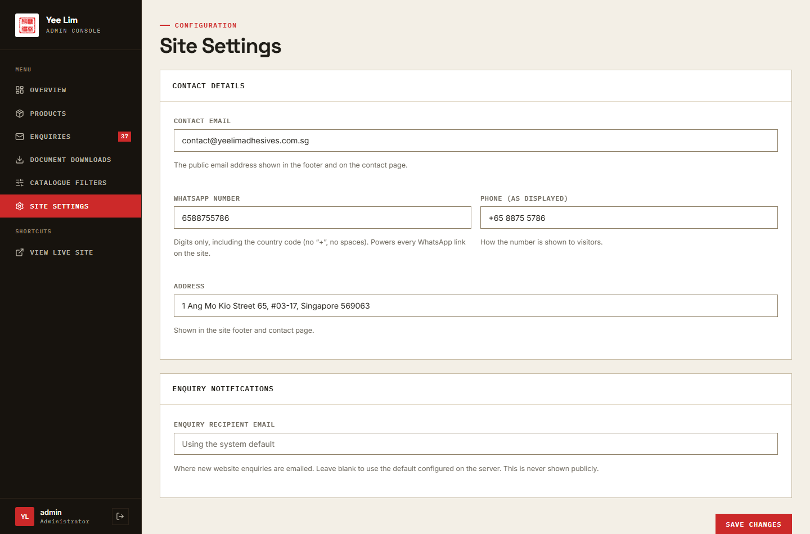
*Screenshot 21. The Site Settings page.*

Go to **Admin, Site Settings**. You can change:

| Setting | Rule | Where it shows |
| --- | --- | --- |
| **Contact email** | Must be a valid email address | Footer and Contact page |
| **WhatsApp number** | Digits only, 8 to 15 digits, including the country code, no `+` and no spaces | Every WhatsApp button on the site |
| **Phone (as displayed)** | Required, up to 40 characters | Wherever the number is shown to visitors |
| **Address** | Required, up to 300 characters | Footer and Contact page |
| **Enquiry recipient email** | Optional, must be valid if filled | Where new enquiry notifications are emailed. Never shown publicly. Leave blank to use the server default. |

*(Verified from code, `frontend/api/settings.php`.)*

Select **Save Changes**, then check the public footer and Contact page.

## 14.5 Where the details are stored

In the website database, in a settings table. The public pages also carry the current
values built in as a fallback, so the site still displays correct details for a moment
before the settings load, and if the database is briefly unreachable.
*(Verified from code)*

## 14.6 What Site Settings cannot change

Business operating hours, the embedded map, the response time sentence, and the Home
and About page content. Those require a developer.

---

# 15. Mobile Website

The site is built to work on phones as a first class experience, not as a shrunken
desktop page. The following differences are intentional. *(Verified from code and
local testing)*

| Area | Mobile behaviour |
| --- | --- |
| **Navigation** | A compact header with a menu button. The **Product Enquiry** action shortens to "Enquiry" with a count badge. |
| **Language selector** | Stays visible in the header at every width. It is not hidden inside the menu. |
| **Filters** | Open in a bottom sheet with a grab handle, custom tick boxes and a **Show products** button. |
| **Product cards** | Two per row, compact, with the brand mark and compare control placed off the photograph. |
| **Compare** | A side tab plus a bottom sheet, with an in sheet product picker and search. |
| **Sticky action buttons** | The product detail page keeps a persistent action bar at the bottom with **Add to Enquiry** and WhatsApp. |
| **Product Detail tabs** | The three tabs become an accordion. Desktop keeps the tabs. |
| **Back to Products** | On mobile the breadcrumb is replaced by a **Back to Products** control that returns the visitor to the catalogue with their previous search, filters and scroll position restored. |
| **Safe area spacing** | Layout respects the notch and home indicator areas on modern phones. |
| **Form inputs** | All form fields are at least 16 pixels, which prevents iPhones from zooming in when a field is tapped. This is deliberate and must not be reduced. *(Project decision, verified from code)* |
| **Contact page form** | There is no form on the Contact page on any device in the current build. |
| **404 page** | Fits on one screen without scrolling. |

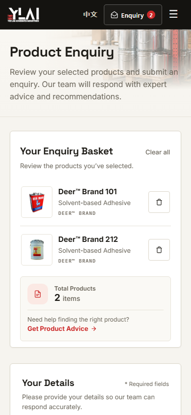
*Screenshot 22. The Product Enquiry page on mobile.*

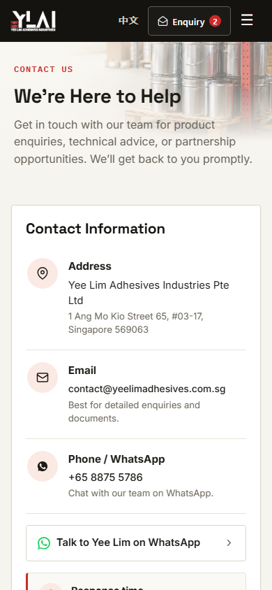
*Screenshot 23. The Contact page on mobile.*

**How to test on mobile:** open the live site on an actual phone, not only in a
desktop browser's mobile preview. Check the catalogue, one product page, the compare
sheet, the enquiry form and the WhatsApp button.

---

# 16. Content Standards

Full rules and a pre publish checklist are in
[04_CONTENT_AND_PRODUCT_DATA_GUIDE.md](04_CONTENT_AND_PRODUCT_DATA_GUIDE.md).
The essentials:

## 16.1 Product names

Use the official product designation exactly, including the brand and the trademark
mark: `Deer™ Brand 212`. Do not add marketing words to the name.

## 16.2 Product descriptions

- **Short description**: one sentence, factual, states what the product is and what it
  is formulated for. This is what appears on the card and in search results.
- **Full description**: two to four sentences expanding on the short description.
  State properties that are genuinely documented. Do not add performance claims that
  are not supported by a data sheet.

## 16.3 Industries, surfaces and materials

Use only values that exist in **Catalogue Filters**. If you need a new one, add it
there first, then tag the product. Spelling must match exactly or the filter will not
group correctly.

## 16.4 Application methods

Enter as a feature in the exact form `Application: Brush or Roll`. See section 6.2.

## 16.5 Suitable uses

Write them inside **How to Use**, after a `Suitable for:` marker, separated by
semicolons. See section 6.4.

## 16.6 Key benefits and characteristics

Enter genuine recorded characteristics in **Features**, for example `Liquid`, `Yellow`,
`Low VOC`, `Fast setting`. Avoid subjective claims such as "the best" or "unbeatable".

## 16.7 Available sizes

Enter as a feature in the exact form `Available in 300G, 1 US Gallon`. See section 6.2.

## 16.8 Availability wording

> **Approved wording. Do not change.**
> The site shows **`Available`** together with
> **`Pricing & lead time confirmed on enquiry`**.
>
> Do **not** change this to "In stock". The site does not track stock levels, and
> "In stock" would be a claim the system cannot support. *(Project decision)*

The alternative state is `Unavailable`.

## 16.9 Contact wording

Keep "We usually respond within 1 to 2 business days" consistent across the Contact
page, the enquiry page and the confirmation email. If the commitment changes, change
all of them together, which requires a developer for the page text.

## 16.10 Chinese translations

Product content added or changed in the admin is English only. Chinese versions are
maintained separately by a developer, and untranslated products fall back to English
automatically. Never machine translate technical or safety wording without a native
speaker review. See section 13.

## 16.11 Technical claims

Every technical or safety claim published on the site must be traceable to a Yee Lim
data sheet or an internal approval. The website performs no verification of what you
type. `[CLIENT TO CONFIRM]` who signs off technical claims internally.

---

# 17. Routine Maintenance

The full schedule, with the reasoning behind each item, is in
[11_SUPPORT_AND_MAINTENANCE_SCHEDULE.md](11_SUPPORT_AND_MAINTENANCE_SCHEDULE.md).

*(These are recommendations. None of them happen automatically today.)*

| Frequency | Checks |
| --- | --- |
| **Weekly** | Open the live site. Review new enquiries and reply. Spot check a few product images. Clear obvious spam or test records. |
| **Monthly** | Back up the website files and the database. Sign in to the admin. Confirm the contact details and the WhatsApp link. Send one test enquiry end to end. Check a few product download links. |
| **Quarterly** | Restore a backup into a test environment and confirm it works. Review who has access. Review outdated products and data sheets. Re check the mobile layouts. Review analytics and search visibility if connected. |
| **Annually** | Renew the domain, hosting and SSL certificate. Review privacy and security obligations. Review all site content. Confirm who provides technical support for the coming year. |

## 17.1 Ownership roles

| Role | Responsibility | Owner |
| --- | --- | --- |
| Content owner | Product data, images, data sheets, contact details | `[CLIENT TO CONFIRM]` |
| Enquiry owner | Responding to leads, keeping the inbox clear | `[CLIENT TO CONFIRM]` |
| Technical owner | Code, database, deployment, hosting | `[CLIENT TO CONFIRM]` |
| Commercial owner | Domain, hosting account, renewals | `[CLIENT TO CONFIRM]` |

## 17.2 Maintenance log

Record every backup, change and incident. Use
[10_CHANGE_LOG_TEMPLATE.md](10_CHANGE_LOG_TEMPLATE.md) and the backup log in the
appendices. A log is what makes a problem diagnosable six months later.

---

# 18. Backups

Detailed steps are in
[05_BACKUP_DEPLOYMENT_AND_ROLLBACK_GUIDE.md](05_BACKUP_DEPLOYMENT_AND_ROLLBACK_GUIDE.md).

## 18.1 Why both files and the database are required

The site has two halves and **neither is any use without the other**:

- The **website files** are the pages, styling, code, uploaded product photographs and
  uploaded PDF data sheets.
- The **database** holds every product record, every enquiry, the catalogue filter
  values, the site settings and the admin accounts.

Restoring only files gives you a working shell with no products. Restoring only the
database gives you products with no website. **Always back up both, at the same time.**

## 18.2 Website file backup

Taken from the hosting control panel's file manager or backup tool. It must include the
`uploads` folder, which holds product photographs and data sheet PDFs.

## 18.3 Database backup

Exported from the hosting control panel's database tool as a single `.sql` file.

## 18.4 How often

*(Recommendation)*

| Situation | Frequency |
| --- | --- |
| Normal operation | Monthly |
| Before any change to the live site | Always, immediately before |
| Before a hosting or PHP version change | Always |
| After a large batch of product updates | Same day |

## 18.5 Naming convention

*(Recommendation)* Use a name that sorts correctly and says what it is:

```
yeelim-files-2026-07-29.zip
yeelim-database-2026-07-29.sql
```

## 18.6 Storage location

`[CLIENT TO CONFIRM]` Agree a location that is **not** the web server itself. A backup
sitting only on the server is lost with the server. Keep at least the three most recent
sets.

## 18.7 Restoration testing

*(Recommendation)* At least once a quarter, have your developer restore a backup into a
test environment and confirm the site loads, products appear and the admin works.
**A backup that has never been restored is an assumption, not a backup.**

---

# 19. Safe Website Updates

This section applies to changes to the **code**, not to editing products in the admin.
Editing products through the admin is safe and needs none of this.

**The rules, in order:**

1. **Test locally or in a staging copy first.** Never make the first attempt on the
   live site.
2. **Take a backup of both files and the database** immediately before deploying.
3. **Record exactly which files are changing.** The project uses an explicit deployment
   list, not a blanket upload.
4. **Deploy only the intended files.** The project's deployment scripts refuse to touch
   the Home page, the About page and the server configuration file.
   *(Verified from code)*
5. **Never overwrite the live configuration file.** It contains the live database
   credentials and is not stored in the source repository at all.
6. **Apply any database changes first**, before uploading code that expects them.
7. **Verify after deployment.** Load the public pages, the admin, and send a test
   enquiry.
8. **Roll back if anything is wrong**, using the backup taken in step 2.

> **Warning about caching.** The site tells browsers to cache styling and code files
> for a long time, using a version number in the file address. Any changed file must be
> given a **new, higher** version number, otherwise visitors keep the old version and
> the site can break in ways that are invisible to the person who deployed it.
> This is a developer responsibility. See
> [05_BACKUP_DEPLOYMENT_AND_ROLLBACK_GUIDE.md](05_BACKUP_DEPLOYMENT_AND_ROLLBACK_GUIDE.md).

---

# 20. Security

Full detail is in [06_SECURITY_AND_ACCESS_GUIDE.md](06_SECURITY_AND_ACCESS_GUIDE.md).

## 20.1 Passwords

- Change the admin password at handover, and whenever a staff member with access leaves.
- Use a long, unique password. Do not reuse it anywhere else.
- Never share it by email or messaging app. Use a password manager.
- `[DEVELOPER TO VERIFY]` There is no self service password change screen in the admin
  in the current build, so a developer performs password changes.

## 20.2 Least privilege

Everyone with an admin login has full rights, including deleting products and
enquiries. Give the login only to staff who need it. See section 5.5.

## 20.3 Secure credential transfer

Use [09_CREDENTIALS_TRANSFER_TEMPLATE.md](09_CREDENTIALS_TRANSFER_TEMPLATE.md) to record
what exists and who owns it, and transfer the actual secrets separately through a
password manager or another agreed secure channel.

## 20.4 Staff departure

Change the admin password, the hosting password and any shared email password on the
day a person with access leaves.

## 20.5 Backups

Backups contain customer personal data from the enquiries table and the document
download records. Store them securely and restrict who can access them.

## 20.6 Production configuration

The live configuration file holds the database credentials and any AI service key. It
is deliberately excluded from the source code repository, and the web server is
configured to refuse to serve it. *(Verified from code)* Never email it, never commit
it, never upload it from a developer machine over the live one.

## 20.7 Spam prevention

Already built in: the hidden decoy field and the rate limits described in section 9.7.
The admin login is also rate limited against password guessing, see section 2.1.
*(Verified from code)*

## 20.8 File upload risks

Uploads are restricted to real JPG, PNG and WEBP images (5 MB) and real PDFs (10 MB),
checked by file content rather than file name. The uploads area is configured so that
no uploaded file can ever be executed as code, and SDS and TDS PDFs cannot be reached
directly by address; they are served only through the gated download link.
*(Verified from code)*

Only upload files you obtained from a trusted source inside Yee Lim.

## 20.9 Software and library updates

`[DEVELOPER TO VERIFY]` The site uses very few third party components by design. A
developer should confirm the PHP version stays supported, and review the small number
of external resources the pages load.

---

# 21. Troubleshooting

A fuller, area by area version is in
[07_TROUBLESHOOTING_GUIDE.md](07_TROUBLESHOOTING_GUIDE.md).

| Problem | Likely cause | Safe action | Developer required? |
| --- | --- | --- | --- |
| Website will not load at all | Hosting outage, expired domain, expired SSL certificate | Try another device and a mobile network. Check whether the hosting or domain renewal is overdue. | **Yes** |
| Admin login not working | Wrong password, or a temporary lock after ten failed attempts | Wait for the time the message states, then try once more, carefully. | Yes, if it still fails |
| A new product does not appear | Not saved, or the browser is showing a cached page | Re open the product in the admin and confirm it saved. Hard refresh the public page. | Only if it persists |
| A product image does not display | No image uploaded, or the upload was rejected | Re upload a JPG, PNG or WEBP file under 5 MB. | Only if a valid file still fails |
| SDS or TDS download fails | Link expired (they last about 15 minutes and work once), or the document was replaced | Request the document again from the product page. | Yes, if a fresh request also fails |
| An enquiry does not appear in the admin | The visitor did not complete the form, or spam protection blocked an automated submission | Send a test enquiry yourself and confirm it appears. | Yes, if your own test does not appear |
| Enquiry email not received | Email delivery configuration, or the message landed in a spam folder | Check the spam folder. Confirm the recipient address in **Site Settings**. The enquiry is still saved in the admin either way. | **Yes** |
| Compare not updating | Browser storage blocked, or private browsing mode | Try a normal browser window. | Only if it persists |
| WhatsApp link goes to the wrong number | The number in **Site Settings** is wrong | Correct it in **Admin, Site Settings**, digits only with the country code. | No |
| Mobile layout looks wrong | Cached old styling files | Hard refresh. Try another phone. | Yes, if it is consistent across devices |
| Chinese text missing on part of a page | That product or that phrase has no Chinese version yet, so it falls back to English | Note the page and report it. | Yes |
| A link gives a "page not found" | The address is wrong or the page was renamed | Note the exact address that failed. | Yes |
| "Something went wrong on our end" message | The website cannot reach its database | Do not retry repeatedly. Report it immediately. | **Yes, urgent** |

> **Never** edit PHP files, SQL, or server settings to fix a problem unless you are the
> developer. Report the symptom and the exact wording of any error message instead.

---

# 22. When to Contact a Developer

## 22.1 Yee Lim staff may safely do all of this

- Add, edit and delete product text through the admin portal.
- Change product status between Available and Unavailable.
- Upload approved product images.
- Upload approved SDS and TDS PDF documents.
- Read, search, export, mark as replied and delete enquiries.
- Review and delete document download records.
- Add, rename, reorder, hide and archive catalogue filter values.
- Change the contact email, WhatsApp number, phone display, address and enquiry
  recipient in **Site Settings**.
- Take backups from the hosting control panel.

## 22.2 A developer is required for all of this

- Any change to the database structure, or running any SQL.
- Any change to an API file, that is any file ending in `.php`.
- Any change to login or authentication behaviour, including resetting a password.
- Any change to JavaScript features: compare, enquiry basket, Bond Finder, Product
  Advisor, language switching, page transitions.
- Any change to shared styling, page layout or the design.
- Adding or removing a page, or changing the Home or About page.
- Changing business hours, the map, or the response time wording.
- Moving to a different host, or changing the domain or DNS records.
- Anything to do with the SSL certificate.
- Restoring a backup.
- Recovering corrupted uploads.
- Any suspected security incident.
- Reading production error logs.
- Adding Chinese translations for new or edited products.

> **If you are not sure which list something belongs to, treat it as the developer list
> and ask.**

---

# 23. Final Handover Checklist

The full version with sign off fields is
[08_FINAL_HANDOVER_CHECKLIST.md](08_FINAL_HANDOVER_CHECKLIST.md). Summary:

- [ ] Live site verified working on desktop and mobile
- [ ] Admin access transferred to Yee Lim
- [ ] All passwords changed after transfer
- [ ] Hosting account access transferred
- [ ] Domain registrar access transferred
- [ ] A database backup delivered and confirmed readable
- [ ] Source code delivered
- [ ] Git repository access delivered
- [ ] Product records verified as complete and correct
- [ ] Enquiries flow verified end to end, including the notification email
- [ ] Images and documents verified on the live site
- [ ] WhatsApp link tested from a real phone
- [ ] Contact details verified against Yee Lim records
- [ ] Mobile tested on a real device
- [ ] Desktop tested
- [ ] Analytics access transferred, if analytics are in use
- [ ] Final client approval recorded and signed

---

# 24. Support and Ownership

| Role | Name and organisation | Contact | Notes |
| --- | --- | --- | --- |
| Website owner | `[TO BE COMPLETED AT FINAL HANDOVER]` | | |
| Content owner | `[TO BE COMPLETED AT FINAL HANDOVER]` | | Products, images, data sheets |
| Technical support provider | `[TO BE COMPLETED AT FINAL HANDOVER]` | | |
| Hosting provider | `[TO BE COMPLETED AT FINAL HANDOVER]` | | Not guessed anywhere in this pack |
| Domain registrar | `[TO BE COMPLETED AT FINAL HANDOVER]` | | Not guessed anywhere in this pack |
| Emergency contact | `[TO BE COMPLETED AT FINAL HANDOVER]` | | For site down situations |
| Support period | `[TO BE COMPLETED AT FINAL HANDOVER]` | | Start and end date |
| Maintenance arrangement | `[TO BE COMPLETED AT FINAL HANDOVER]` | | What is included, response times, cost |

---

# Appendices

## Appendix A. Glossary

| Term | Meaning |
| --- | --- |
| **Admin portal** | The password protected area where staff manage the site. |
| **API** | The programs on the server that the website pages talk to in order to read and save data. |
| **Backup** | A stored copy of the website files and the database, taken at a point in time. |
| **Cache** | A stored copy of a file that a browser or network keeps to load pages faster. Can make a change appear "not to have worked" until refreshed. |
| **Cache busting / version number** | The `?v=` number at the end of a styling or code file address. Increasing it forces browsers to fetch the new version. |
| **cPanel** | A common web hosting control panel used to manage files, databases, email and backups. |
| **CSV** | A spreadsheet file format, used for the enquiry export. |
| **Database** | Where product records, enquiries, filter values and settings are stored. |
| **Deployment** | Copying updated website files from a developer's computer onto the live server. |
| **DNS** | The system that points the domain name at the hosting server. |
| **Enquiry basket** | The visitor's collection of products before they submit one enquiry. |
| **Gated download** | A download that requires the visitor to submit their details first. |
| **PHP** | The programming language the server side of this website is written in. |
| **Rate limit** | A cap on how many times something can be done from one internet connection in a period, used to stop spam and password guessing. |
| **Rollback** | Restoring the previous version after a change goes wrong. |
| **SDS** | Safety Data Sheet. |
| **SSL certificate** | What makes the address start with `https` and shows a padlock. Expires and must be renewed. |
| **Staging** | A private copy of the site used to test changes before they go live. |
| **TDS** | Technical Data Sheet. |

## Appendix B. Page and file reference

| Public page | Address | Source file |
| --- | --- | --- |
| Products | `/products` | `frontend/products.html` |
| Product Detail | `/product-detail?id=<number>` | `frontend/product-detail.html` |
| Compare | `/compare` | `frontend/compare.html` |
| Product Enquiry | `/enquiry` | `frontend/enquiry.html` |
| Contact | `/contact` | `frontend/contact.html` |
| Page not found | shown automatically | `frontend/404.html` |
| Home | `/` | Not in this repository, live server only |
| About | `/about` | Placeholder only in this repository, live server only |

| Admin page | Address | Source file |
| --- | --- | --- |
| Login | `/admin/login.html` | `frontend/admin/login.html` |
| Overview | `/admin/dashboard.html` | `frontend/admin/dashboard.html` |
| Products | `/admin/products.html` | `frontend/admin/products.html` |
| Enquiries | `/admin/enquiries.html` | `frontend/admin/enquiries.html` |
| Document Downloads | `/admin/downloads.html` | `frontend/admin/downloads.html` |
| Catalogue Filters | `/admin/filters.html` | `frontend/admin/filters.html` |
| Site Settings | `/admin/settings.html` | `frontend/admin/settings.html` |

A full technical file map is in
[03_TECHNICAL_HANDOVER.md](03_TECHNICAL_HANDOVER.md).

## Appendix C. Product data field reference

| Admin field | Stored as | Required | Appears on |
| --- | --- | --- | --- |
| Product Name | `name` | Yes, max 200 characters | Card, detail page, compare, enquiry, search |
| Category | `category` | Yes | Filtering, dashboard breakdown |
| Short Description | `short_description` | Yes, max 5000 characters | Card, detail page, advisor, search |
| Brand | `brand` | No | Card, detail specification, Brand filter |
| Product Type | `product_type` | No, auto assigned if blank | Detail specification, Product Type filter |
| Industries | `industries` | No, comma separated | Detail specification, Industry filter, search |
| Surfaces | `surfaces` | No, comma separated | Detail specification, Surface filter, Bond Finder, search |
| Features | `features` | No, comma separated | Application Method, Available Sizes and Characteristics rows, search |
| Full Description | `full_description` | No | Detail page, search |
| How to Use | `usage_text` | No | Application & Suitable Uses tab, search |
| Status | `status` | Set from the list, not the form | Availability label everywhere |
| Main image | `image_url` | No | Card, gallery |
| Additional images | `images` | No | Gallery |
| SDS PDF | `product_documents` records | No | Downloads tab |
| TDS PDF | `product_documents` records | No | Downloads tab |

## Appendix D. Backup log template

| Date | Taken by | Files backed up (Y/N) | Database backed up (Y/N) | Backup name | Stored where | Restore tested | Notes |
| --- | --- | --- | --- | --- | --- | --- | --- |
|  |  |  |  |  |  |  |  |
|  |  |  |  |  |  |  |  |
|  |  |  |  |  |  |  |  |

## Appendix E. Deployment log template

| Date | Deployed by | Change summary | Files deployed | Database change (Y/N) | Backup reference | Verified by | Result | Rolled back (Y/N) |
| --- | --- | --- | --- | --- | --- | --- | --- | --- |
|  |  |  |  |  |  |  |  |  |
|  |  |  |  |  |  |  |  |  |

The full version is in [10_CHANGE_LOG_TEMPLATE.md](10_CHANGE_LOG_TEMPLATE.md).

## Appendix F. Issue reporting template

Copy this when reporting a problem to your developer. The more of it you fill in, the
faster it is fixed.

```
Reported by:
Date and time (including time zone):

What page or screen:
Exact web address:

What I was trying to do:

What I expected to happen:

What actually happened:
(Copy the exact wording of any error message.)

Does it happen every time, or only sometimes:

Device and browser:
(For example: iPhone 14, Safari / Windows 11, Chrome)

Also happens on a different device or browser:  Yes / No / Not tested

Screenshot attached:  Yes / No

Anything changed recently:
(New product added, document uploaded, settings changed, deployment done)

How urgent:  Site down / Blocking work / Annoying / Cosmetic
```

## Appendix G. Credential transfer checklist

Use [09_CREDENTIALS_TRANSFER_TEMPLATE.md](09_CREDENTIALS_TRANSFER_TEMPLATE.md) for the
full form. At minimum, confirm all of the following are transferred and then changed:

- [ ] Hosting control panel account
- [ ] FTP or file transfer account, and any temporary account deleted afterwards
- [ ] Website database user
- [ ] Website admin portal login
- [ ] Domain registrar account
- [ ] Any email or SMTP account used for site notifications
- [ ] Git repository access
- [ ] Any AI service key used by the Product Advisor
- [ ] Analytics and Search Console access, if in use
- [ ] All passwords changed by Yee Lim after transfer
- [ ] Transfer method recorded, and the transfer channel cleared afterwards

---

*End of the Yee Lim Adhesives Website Handover Guide.*
