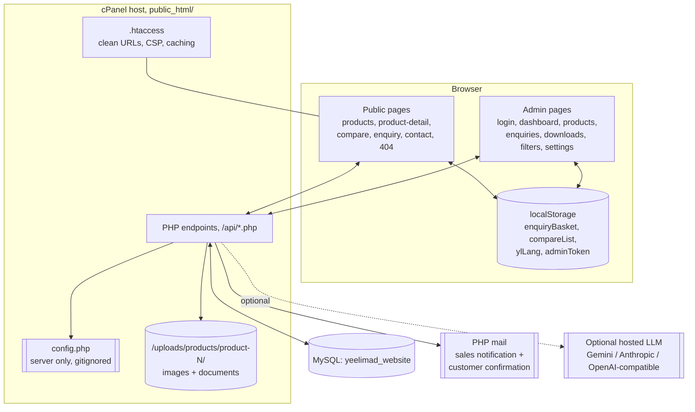
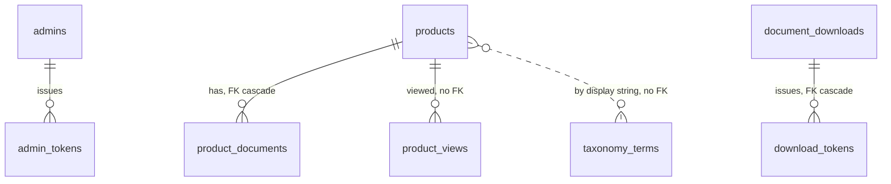

# 03. Technical Handover

**Project ReBond, Yee Lim Adhesives Industries Pte Ltd**
**Audience: the developer or web vendor taking over this website.**

Everything here was read out of the repository working tree on branch `products-admin`,
starting at commit `dc7c394`, and verified by running the site locally on 29 July 2026.
Where a fact could only be confirmed on the live server, it is marked
`[DEVELOPER TO VERIFY]`.

> **A live demonstration of constraint 12.2.** While this documentation was being written,
> a second contributor committed `807e6d4` to the same branch and working tree, bumping
> `dropdown-ui.css` to `?v=10` and `custom-select.js` to `?v=7` across all eleven HTML
> files, and leaving six admin HTML files modified in the working tree. This is normal for
> this project and is exactly why the deployment procedure in section 11.4 begins by
> re-checking `git log` and diffing against live. Treat every version number in this
> document as a snapshot, not a constant.

---

## Contents

1. [System Summary](#1-system-summary)
2. [Architecture](#2-architecture)
3. [Repository Structure](#3-repository-structure)
4. [Page Ownership](#4-page-ownership)
5. [Public Components](#5-public-components)
6. [APIs](#6-apis)
7. [Database](#7-database)
8. [Environment Configuration](#8-environment-configuration)
9. [Local Development](#9-local-development)
10. [Testing](#10-testing)
11. [Deployment](#11-deployment)
12. [Known Constraints](#12-known-constraints)
13. [Future Recommendations](#13-future-recommendations)

---

# 1. System Summary

| Layer | Technology |
| --- | --- |
| Frontend | Plain HTML5, CSS and vanilla JavaScript. **No framework, no bundler, no build step.** |
| Page transitions | Swup v4, vendored at `frontend/js/vendor/swup.umd.js`, giving single page application style navigation across the five public pages. |
| Icons (admin only) | Lucide, loaded from `unpkg.com`. |
| Fonts | Google Fonts, imported from the stylesheet. |
| Backend | PHP, procedural, one file per endpoint, PDO with prepared statements. |
| Database | MySQL, database name `yeelimad_website`. |
| Hosting | Shared cPanel hosting with PHP and MySQL, no Node runtime. Provider `[CLIENT TO CONFIRM]`. |
| Email | PHP `mail()`, with the envelope sender set for SPF alignment. |
| AI (optional) | A server side proxy supporting Gemini, Anthropic, or any OpenAI compatible endpoint. Falls back to a rule based matcher. |

**Do not introduce a build pipeline, a framework, or a Node runtime requirement.** The
hosting does not support it, and the deployment model is file by file upload.

## 1.1 Browser requirements

Modern evergreen browsers. The code is ES5 and ES6 era JavaScript with no
transpilation, uses `fetch`, `localStorage`, `matchMedia` and CSS custom properties.
`[DEVELOPER TO VERIFY]` No formal browser support matrix is documented in the
repository. Confirm the required baseline with the client before dropping anything.

## 1.2 Responsive approach

Mobile is treated as a distinct design, not a scaled desktop. The principal breakpoint
is `max-width: 640px`, with additional handling at 768 and 1024 pixels. Mobile specific
behaviours are listed in section 15 of
[01_YEE_LIM_WEBSITE_HANDOVER_GUIDE.md](01_YEE_LIM_WEBSITE_HANDOVER_GUIDE.md).

A hard project rule: **every form input must be at least 16 pixels at 640 pixels and
below**, otherwise iOS Safari zooms on focus. This is enforced in `products.css` with an
`!important` rule that must not be weakened.

## 1.3 Accessibility approach

Present in the current code:

- Semantic landmarks, `role="tab"` / `role="tabpanel"` on the product detail tabs with
  arrow key navigation, `aria-selected`, `aria-controls`, `aria-expanded` on filter
  groups.
- A single polite live region (`#ylStatus`, created once outside the Swup container) used
  to announce enquiry basket changes, because the visible success toast was deliberately
  removed.
- `aria-label` and `aria-labelledby` on icon only controls and dialogs.
- `:focus-visible` outlines on the language switch and other custom controls.
- `prefers-reduced-motion` respected on the admin page animation.

`[DEVELOPER TO VERIFY]` There is no automated accessibility test suite and no recorded
WCAG conformance statement. Treat accessibility as partially addressed, not certified.

---

# 2. Architecture



**Key architectural facts:**

- There is **no server side rendering**. Every page is static HTML that fetches JSON from
  `/api/*.php` and renders in the browser.
- **The AI call is made server side only.** The API key never reaches the browser.
- **Uploaded SDS and TDS PDFs are not directly reachable.** `uploads/.htaccess` blocks any
  path containing `/documents/`; they are streamed only by `api/download_document.php`
  in exchange for a single use token.
- **Admin authentication is a bearer token** stored in `localStorage`, validated against
  the `admin_tokens` table on every protected request.

---

# 3. Repository Structure

Only significant paths are listed.

```
Major-Project/
├── frontend/                     # everything that is deployed to public_html/
│   ├── .htaccess                 # clean URLs, security headers + CSP, cache policy, 404
│   ├── router.php                # LOCAL DEV ONLY, mirrors the .htaccess rules
│   ├── server.json               # { "cleanUrls": true } for static dev servers
│   │
│   ├── products.html             # catalogue
│   ├── product-detail.html       # product detail, 3 tabs
│   ├── compare.html              # compare shell (rendered by compare-page.js)
│   ├── enquiry.html              # enquiry basket + form
│   ├── contact.html              # contact info, hours, map (no form)
│   ├── 404.html                  # not found
│   ├── about.html                # EMPTY PLACEHOLDER, never deploy, see section 4
│   │
│   ├── admin/
│   │   ├── .htaccess             # no-cache for admin HTML only
│   │   ├── login.html / login.js
│   │   ├── dashboard.html / overview.js
│   │   ├── products.html / admin.js        # product CRUD + image/document upload UI
│   │   ├── enquiries.html / enquiries.js   # inbox, panel, CSV export
│   │   ├── downloads.html / downloads.js   # SDS/TDS download records
│   │   ├── filters.html / filters.js       # taxonomy management
│   │   ├── settings.html / settings.js     # site contact settings
│   │   ├── admin-spa.js                    # in-admin page swapping
│   │   ├── admin-nav.js                    # sidebar state + unread badge
│   │   └── admin.css
│   │
│   ├── api/                      # PHP endpoints, see section 6
│   │   ├── config.php            # GITIGNORED, live secrets, server only
│   │   ├── config.example.php    # template, no secrets
│   │   ├── db.php                # PDO bootstrap + shared rate limit helpers
│   │   ├── auth.php              # requireAdmin() bearer token guard
│   │   └── ... (18 more endpoints)
│   │
│   ├── css/
│   │   ├── products.css          # the main stylesheet, ~6,400 lines, all public pages
│   │   ├── dropdown-ui.css       # custom select styling
│   │   ├── 404.css
│   │   └── contact-additions.css # superseded, folded into products.css at dc7c394
│   │
│   ├── js/
│   │   ├── i18n.js               # EN/ZH engine + interface dictionary
│   │   ├── i18n-products.js      # per-product Chinese content, keyed by product id
│   │   ├── data.js               # brand lists, slugs, derived product type helpers
│   │   ├── core/app.js           # SPA lifecycle, enquiry basket, toast, site settings
│   │   ├── pages/                # products, product-detail, compare-page, enquiry,
│   │   │                         # contact, not-found
│   │   ├── widgets/              # navbar, footer, compare, custom-select, chatbot,
│   │   │                         # page-transitions
│   │   └── vendor/swup.umd.js
│   │
│   ├── images/                   # hero, brand logos, static product imagery
│   └── uploads/
│       ├── .htaccess             # no script execution, no listing, /documents/ blocked
│       └── products/product-<id>/[documents/]
│
├── database/
│   ├── schema.sql                # core tables
│   ├── seed_products.sql         # the 31 real catalogue products
│   ├── product_documents.sql     # RECONSTRUCTED from live, do NOT run on live
│   ├── 2026-07-21_taxonomy_terms.sql
│   ├── 2026-07-21_products_product_type.sql
│   ├── 2026-07-21_site_settings.sql
│   ├── 2026-07-21_document_downloads.sql
│   ├── 2026-07-21_download_tokens.sql
│   ├── fix_suitable_uses_delimiters.sql
│   └── migrations/2026-07-22_product_views.sql
│
├── tests/                        # node:test unit tests over the source files
├── qa/                           # Playwright end to end + QA scripts (gitignored)
├── backend/                      # LEGACY Node/Express + MongoDB prototype, NOT used
├── deploy_all.sh                 # full FTP deploy, backup + upload + verify
├── deploy_rebond_public.sh       # public pages only FTP deploy
├── DEPLOYMENT_CPANEL.md          # canonical deployment reference
└── docs/client-handover/         # this documentation pack
```

## 3.1 Things that must never be deployed

From `DEPLOYMENT_CPANEL.md` and the deploy scripts *(Verified from code)*:

- `frontend/api/config.php`, live secrets, maintained by hand on the server.
- `frontend/about.html` and any `index.html` from this repository, see section 4.
- `backend/`, the legacy Node prototype.
- `database/*.sql`, import through phpMyAdmin instead; they must not sit in the web root.
- `qa/`, `node_modules/`, `screenshots/`, `.git/`, and all internal `.md` documentation.

## 3.2 Legacy code

`backend/` is a Node/Express plus MongoDB prototype from before the cPanel migration. It
is **not used in production**, is not deployed, and should be treated as historical. The
PHP API in `frontend/api/` is the only backend.

---

# 4. Page Ownership

This is the single most important operational fact in the project.

| Page | Owner | Rule |
| --- | --- | --- |
| `products.html`, `product-detail.html`, `compare.html`, `enquiry.html`, `contact.html`, `404.html` | Project ReBond | Safe to edit and deploy through the normal process. |
| All of `admin/` | Project ReBond, **except** the upload components, see below | Safe to edit, but test before deploying. |
| All of `api/` | Project ReBond | Safe to edit, but never deploy `config.php`. |
| **Home page** (`index.html`) | A separate contributor, **live server only** | Not in this repository. `deploy_all.sh` and `deploy_rebond_public.sh` both hard fail if it appears in the deploy list. |
| **About page** (`about.html`) | A separate contributor, **live server only** | The repository copy is a **0 byte placeholder**. Deploying it would blank the live page. |
| `css/products.css`, `js/widgets/*`, `js/core/app.js`, `js/data.js` | Shared across all pages including the ones above | Always download the live copy and diff both directions before uploading. See section 12.2. |

## 4.1 Protected upload components

The **Product Images** and **Product Documents** upload areas of the admin product form,
and their endpoints, were built by a separate contributor and are live in production:

| Component | Files |
| --- | --- |
| Product image upload | The `.image-upload-layout` block in `frontend/admin/products.html`; `uploadProductImages()` in `frontend/admin/admin.js`; `frontend/api/upload-product-images.php` |
| Product document upload | The `.document-upload-layout` block in `frontend/admin/products.html`; `uploadProductDocument()` and `deleteProductDocument()` in `frontend/admin/admin.js`; `frontend/api/upload_product_document.php`, `product_documents.php`, `delete_product_document.php` |
| Backing table | `product_documents`, which **already exists on the live database**. `database/product_documents.sql` is a reconstruction for local development only and must not be run against live. |

> **These components must be preserved.** A future developer should replace them only
> deliberately, after taking a full backup, reproducing the behaviour, and testing the
> full upload, replace and delete cycle. They were not modified while producing this
> documentation.

---

# 5. Public Components

| Component | File | Notes |
| --- | --- | --- |
| **Navbar** | `js/widgets/navbar.js` | Injects the header on every public page. Owns the mobile drawer, the enquiry count badge, and the language switch. The language control stays in the header at every width and shows only the language you are **not** in. |
| **Footer** | `js/widgets/footer.js` | Injects the footer. Carries the address, email, phone and WhatsApp, each tagged with `data-yl-*` hooks so Site Settings can override them at runtime. Has a distinct mobile variant. |
| **SPA core** | `js/core/app.js` | `ylReady`/`ylRunReady` page lifecycle (every registered init must be idempotent and self selecting), `ylOnce` for one time listeners, the enquiry basket (`localStorage` key `enquiryBasket`), the error toast, the `#ylStatus` live region, and the Site Settings fetch and application. |
| **Page transitions** | `js/widgets/page-transitions.js` | Swup configuration. After each content swap it calls `ylRunReady()`. **Any new page script must register through `ylReady` or it will stop working after the first navigation.** |
| **Compare** | `js/widgets/compare.js`, `js/pages/compare-page.js` | Maximum three products (`COMPARE_MAX = 3`), stored under `localStorage` key `compareList`. Desktop tray, mobile side tab plus bottom sheet, tiered picker search. |
| **Product Advisor** | `js/widgets/chatbot.js` plus `api/advisor.php` | Chat panel, opened by `window.openProductAdvisor()`. All intelligence is server side. |
| **Bond Finder** | Markup in `products.html`, logic in `js/pages/products.js` | Deterministic scoring, no AI. Two surfaces required, industry and application method optional. Produces a match percentage and a pre-filled WhatsApp link. |
| **Custom selects** | `js/widgets/custom-select.js`, `css/dropdown-ui.css` | Replaces native selects so open states are stylable and consistent. |
| **Translation system** | `js/i18n.js`, `js/i18n-products.js` | See section 5.1. |
| **Mobile sticky controls** | `js/pages/product-detail.js`, `css/products.css` | Persistent bottom action bar on the product detail page at 640 pixels and below. |

## 5.1 Translation system

- `js/i18n.js` holds the interface dictionary and exposes `window.ylLang`, `window.ylT(key)`,
  `window.ylSetLang(lang)` and `window.ylApplyI18n(root)`.
- Elements opt in with `data-i18n="key"` for text content, or
  `data-i18n-attr="attr:key,attr2:key2"` for attributes.
- **English is the source of truth.** `ylApplyI18n` returns immediately when the language
  is English, so the original markup is never touched. Only Chinese swaps text.
- The choice is stored under `localStorage` key `ylLang`, and switching reloads the page
  so every script re-renders in language.
- `js/i18n-products.js` holds per product Chinese content keyed by product id, with
  optional `name`, `shortDescription`, `fullDescription` and `usage`. Missing entries fall
  back to English, so partial coverage is safe.
- The Chinese strings are described in the source as **first pass drafts requiring native
  speaker review**. The `usage` / "Suitable for" lists are intentionally left in English,
  because the detail page parses them with an English delimiter.

**Maintenance implication:** the admin panel is English only. Adding a product in the
admin does not create its Chinese entry; a developer must add it to `i18n-products.js`
and bump that file's `?v=`.

---

# 6. APIs

All endpoints live in `frontend/api/` and are reached at `/api/<file>.php`. All responses
are JSON unless stated. All database access uses PDO prepared statements.

**Authentication model.** `login.php` issues a 64 hex character bearer token stored in
`admin_tokens` with a 24 hour expiry. Protected endpoints call `requireAdmin($pdo)` from
`auth.php`, which validates the `Authorization: Bearer <token>` header against
`admin_tokens` joined to `admins`, checks expiry, deletes expired tokens, and responds
401 and exits on any failure.

**Shared error behaviour.** `db.php` disables `display_errors`, enables `log_errors`, and
returns **503** with a reassuring message when the database is unreachable, so the client
can distinguish "our fault" from "your input".

**Shared rate limiting.** `db.php` provides `ylRateRecentCount`, `ylRateAdd`,
`ylRateClear` and `ylRateRetryAfter`, backed by JSON files in the system temp directory,
keyed by an md5 of the bucket name. All helpers swallow their own failures so a limiter
fault can never block a legitimate request.

## 6.1 Endpoint reference

### `products.php`

| Method | Auth | Purpose |
| --- | --- | --- |
| `GET` | Public | List products, or one product with `?id=N`. |
| `POST` | **Admin** | Create a product. |
| `PUT ?id=N` | **Admin** | Update a product. |
| `DELETE ?id=N` | **Admin** | Delete a product **and recursively delete `uploads/products/product-N/`**. |

- **GET query parameters:** `id`, `search`, `category`, `brand`, `industry`, `surface`.
  `search` is a `LIKE %term%` across name, brand, category, both descriptions,
  `usage_text`, and the three JSON columns. `industry` and `surface` are `LIKE` matches
  against the JSON columns. Ordered by `created_at DESC`.
- **Output shape:** camelCase, including `id` and `_id` as strings (a MongoDB era
  compatibility artefact), `productType`, `shortDescription`, `fullDescription`, `usage`,
  `imageUrl`, `images[]`, `sdsUrl`, `tdsUrl`, `hasSds`, `hasTds`, `status`, `industries[]`,
  `surfaces[]`, `features[]`, `createdAt`, `updatedAt`.
- `hasSds` / `hasTds` are computed from `product_documents` via `productDocFlagsMap()`,
  which **deliberately does not expose document URLs**, so the download gate cannot be
  bypassed from the public product payload. It tolerates the table being absent.
- **Validation:** `name` and `shortDescription` required; `name` maximum 200 characters,
  `shortDescription` maximum 5000. Empty `sds_url` / `tds_url` are stored as `NULL`.
- **`product_type` fallback on create:** `Spray Guns & Accessories` when
  `brand = 'Others & Accessories'` or `category = 'Others'`, otherwise `Adhesives`.
- **Errors:** 400 validation, 401 unauthenticated, 404 not found, 405 wrong method,
  500 database error.
- **Tables:** `products`, reads `product_documents`.

### `enquiries.php`

| Method | Auth | Purpose |
| --- | --- | --- |
| `POST` | Public | Submit an enquiry. |
| `GET` | **Admin** | List all enquiries newest first, or one with `?id=N`. |
| `GET ?action=replied&id=N&token=T` | Public, token | One tap "mark as replied" from the notification email. Returns a small branded HTML page, not JSON. |
| `PATCH ?id=N` | **Admin** | `{ "replied": 0|1 }`. |
| `DELETE ?id=N` | **Admin** | Delete an enquiry. |

- **POST input:** `name` (required), `company`, `email` (required, validated), `phone`,
  `message`, `products[]`, and the honeypot field `website`.
- **Spam guards:** the honeypot returns a fake 201 and saves nothing; the per IP limit is
  5 submissions per 10 minutes, returning 429 with an accurate `Retry-After`.
- **Length caps:** name and company 200, email 254, phone 50, message 5000, products 100
  entries.
- **Order of operations:** save to the database first, then attempt both emails inside
  `try`/`catch`. **Email failure never affects the response or the saved record.**
- **Reference number:** derived, not stored. `YL-<year of created_at>-<id zero padded to 4>`.
- **`reply_token`:** 64 hex characters, used only for the email link, compared with
  `hash_equals`.
- **Recipient resolution:** `site_settings.enquiry_recipient` when set, otherwise the
  `ENQUIRY_NOTIFY_TO` constant. Tolerates `site_settings` not existing.
- **Mail hardening:** CR and LF stripped from all header values; `From` and the envelope
  sender (`-f`) both set to `ENQUIRY_FROM` for SPF alignment.
- **Tables:** `enquiries`, reads `site_settings`.

### `login.php`

`POST` public. Input `{ username, password }`. Verifies with `password_verify` against
`admins.password_hash`. On success it opportunistically garbage collects expired tokens,
issues a token (`bin2hex(random_bytes(32))`) with a 24 hour expiry, and clears the rate
limit bucket. **Only failed attempts count** toward the limit of 10 per 15 minutes per IP;
exceeding it returns 429 with `Retry-After`. Errors: 400 missing fields, 401 bad
credentials, 429 throttled, 405, 500. Tables: `admins`, `admin_tokens`.

### `logout.php`

`POST`, bearer token. Deletes the token row. Always reports success. Table: `admin_tokens`.

### `me.php`

`GET`, bearer token. Returns `{ admin: { id, username } }`. Deletes the token and returns
401 if it has expired. Tables: `admin_tokens`, `admins`.

### `auth.php`

Not an endpoint. Provides `getBearerToken()` and `requireAdmin($pdo)`.

### `db.php`

Not an endpoint. PDO bootstrap plus the rate limit helpers. Reads `config.php`.

### `settings.php`

| Method | Auth | Purpose |
| --- | --- | --- |
| `GET` | Public | Returns only `contact_email`, `whatsapp_number`, `phone_display`, `address_line`. |
| `GET ?scope=admin` | **Admin** | All keys, including `enquiry_recipient`. |
| `PUT` / `PATCH` | **Admin** | Update validated values, upsert with `ON DUPLICATE KEY UPDATE`, records `updated_by`. |

Validation: emails via `FILTER_VALIDATE_EMAIL` (empty allowed for the optional email
keys); `whatsapp_number` must match `^[0-9]{8,15}$`; `phone_display` required, maximum 40;
`address_line` required, maximum 300. Unknown keys are ignored. **`enquiry_recipient` is
never returned by the public GET.** Table: `site_settings`.

### `taxonomies.php`

| Method | Auth | Purpose |
| --- | --- | --- |
| `GET` | Public | Active terms per group, for the public sidebar. |
| `GET ?scope=admin` | **Admin** | All terms including archived, with usage counts. |
| `POST` | **Admin** | Add a term. |
| `PUT` / `PATCH ?id=N` | **Admin** | Rename, reorder, archive, set logo, set visibility. |
| `DELETE ?id=N` | **Admin** | Delete an unused term. Returns **409** if products still use it. |

Groups: `product_type`, `brand`, `industry`, `surface`. Slugs are produced by `taxSlug()`,
which mirrors `ylSlug` in `js/pages/products.js` (lowercase, strip ™ and ®, non
alphanumerics collapse to a single hyphen), so admin created slugs match the public URL
scheme. **A rename rewrites the matching product strings inside one transaction**, single
value columns by `UPDATE`, JSON arrays rebuilt in PHP. Usage counts are computed in PHP
over the catalogue, so no `JSON_TABLE` is required. Tables: `taxonomy_terms`, `products`.

### `advisor.php`

`POST` public. Input `{ messages: [{ role: "user"|"assistant", content }] }`.
Output `{ reply, source: "ai" | "catalogue" | "error" }`.

- Rate limit: 30 messages per 10 minutes per IP, then 429.
- Sanitising: each message truncated to 1000 characters, last 12 turns kept, leading
  assistant turns trimmed so the history starts with a user turn.
- Loads the catalogue from `products` and builds a grounded system prompt.
- Provider selected by `LLM_PROVIDER`: `gemini`, `anthropic`, or `openai` compatible via
  `LLM_BASE_URL`. Key from `LLM_API_KEY`, model from `LLM_MODEL`.
- **Falls back to `ruleBasedReply()`** when no provider is configured or the call fails:
  small talk handling, a company fact responder, then a synonym and keyword scorer over
  the catalogue returning the top three, and it never presents an `Unavailable` product as
  if it were in stock.
- Requires PHP cURL and outbound HTTPS only when a provider is configured.
- Table: `products`.

### `track_view.php`

`POST` public, best effort. Input `{ product_id, session }`. Always returns **204** and
never returns data. Guards: skips requests carrying an `Authorization` header so admin
views are not counted; caps 60 pings per IP per minute; verifies the product exists;
dedupes per session, product and day using a SHA-256 hash. Table: `product_views`.

### `analytics.php`

`GET`, **admin**. Returns `topProducts` (30 days, top 8), `viewsTrend` (14 days),
`categoryViews` (30 days) and `conversion` (30 day views versus enquiries plus a rate).
Tolerates `product_views` not existing, returning zeros with a `note`. Tables:
`product_views`, `products`, `enquiries`.

### `upload-product-images.php`

`POST` multipart. Fields: `product_id`, `main_image`, `extra_images[]`.
Allowed MIME types `image/jpeg`, `image/png`, `image/webp`, detected with
`mime_content_type`. Maximum 5 MB per file. Stored at
`uploads/products/product-<id>/<main|extra>-<time>-<rand>.<ext>` and the public path is
returned. Errors return 400 with a message.

> **Security finding.** This endpoint does **not** call `requireAdmin($pdo)`, unlike every
> other write endpoint, and it does not sanitise `product_id` beyond stripping non
> alphanumeric characters. Anyone who can reach the URL can write image files into the
> uploads tree. See section 13, Urgent. *(Verified from code)*

### `upload_product_document.php`

`POST` multipart, **admin**. Fields: `product_id`, `document_type` (`SDS`, `TDS` or
`OTHER`), `document_file`. PDF only, verified with `finfo` MIME detection, maximum 10 MB.
Confirms the product exists. Stores at
`uploads/products/product-<id>/documents/<type>-<time>-<8 hex>.pdf`.
**SDS and TDS are one per product**: the insert runs in a transaction that first deletes
the previous row of that type, and the old physical file is unlinked only after the
transaction commits. On database failure it rolls back and removes the newly written file.
Table: `product_documents`.

### `product_documents.php`

`GET ?product_id=N`, **admin only**. Returns the document rows including `file_path`.
It is admin gated precisely because exposing `file_path` publicly would bypass the
download gate. Table: `product_documents`.

### `delete_product_document.php`

`DELETE ?id=N`, **admin**. Unlinks the physical file, then deletes the row.
Table: `product_documents`.

### `document_request.php`

`POST` public. The download gate. Input `{ productId, docType: "sds"|"tds", name, email,
company, phone, website }`. Honeypot plus a 30 per hour per IP limit, counted only after
validation passes. Requires `name`, `email` (validated) and `company`. **Verifies the
product actually has that document type** before issuing anything. In one transaction it
inserts a `document_downloads` row and a `download_tokens` row with a 15 minute expiry,
then returns `{ success, downloadUrl: "api/download_document.php?t=<token>" }`.
Tables: `document_downloads`, `download_tokens`, `products`, `product_documents`.

### `download_document.php`

`GET ?t=<64 hex>`. Streams the PDF. Rejects a malformed token (400), unknown token (404),
already used token (410), expired token (410). Resolves the file **server side** from
`product_documents`, never from user input, and enforces that the `realpath` sits inside
`uploads/`. **Marks the token used before streaming**, so one token can never serve twice.
Sends `Content-Disposition: attachment` with a sanitised filename, `nosniff`, and
`Cache-Control: private, no-store`.

### `downloads.php`

`GET`, **admin**: all download records newest first.
`DELETE ?id=N` or `DELETE { ids: [] }`, **admin**: delete one or several.
This data is managed only in the admin and is never emailed. Table: `document_downloads`.

---

# 7. Database

Database name: `yeelimad_website`. Character set `utf8mb4`. Engine defaults apply.

## 7.1 Tables

### `admins`
`id`, `username`, `password_hash` (PHP `password_hash`), `created_at`, `updated_at`.
Index `idx_admins_username`.

### `admin_tokens`
`id`, `admin_id` (FK to `admins`, `ON DELETE CASCADE`), `token` VARCHAR(64),
`expires_at`, `created_at`. Index `idx_admin_tokens_token`.

### `products`
| Column | Notes |
| --- | --- |
| `id` | Primary key. Used in public URLs as `?id=N` and as the key into `i18n-products.js`. |
| `mongo_id` | Legacy identifier from the Node/MongoDB prototype. Not used by current code. |
| `name`, `brand`, `category` | `brand` defaults to `'Yee Lim'` in the schema, but the admin form offers the four trademark brands plus `Others & Accessories`. |
| `product_type` | Added by `2026-07-21_products_product_type.sql`. Nullable, sits after `category`. |
| `short_description` (required), `full_description`, `usage_text` | `usage_text` holds "How to Use" and the `Suitable for:` list. |
| `image_url`, `images` (JSON) | Main image plus the gallery array. |
| `sds_url`, `tds_url` | Legacy optional link columns, superseded by `product_documents`. The admin form writes empty strings, which the API stores as `NULL`. |
| `status` | `ENUM('Available','Unavailable')`, default `Available`. |
| `industries`, `surfaces`, `features` | JSON arrays of display strings. |
| `created_at`, `updated_at` | |

### `enquiries`
`id`, `name`, `company`, `email`, `phone`, `message`, `products` (JSON array of product
names), `reply_token` VARCHAR(64), `replied` TINYINT default 0, `created_at`.
Index `idx_enquiries_created`. The reference number is **derived, not stored**.

### `product_documents` (protected, live originated)
`id`, `product_id` (FK to `products`, `ON DELETE CASCADE`), `document_type`
(`SDS`/`TDS`/`OTHER`), `original_name`, `stored_name`, `file_path`, `file_size`,
`uploaded_at`. Index `idx_pd_product (product_id, document_type)`.
**`database/product_documents.sql` is a reconstruction for local development. The table
already exists on live and that file must never be run there.**

### `taxonomy_terms`
`id`, `group_key` ENUM(`product_type`,`brand`,`industry`,`surface`), `label`, `slug`,
`logo_url`, `logo_alt`, `sort_order`, `public_visible`, `archived`, timestamps.
Unique keys on `(group_key, slug)` and `(group_key, label)`; index
`idx_group_active (group_key, archived, sort_order)`.
Seeded with 2 product types, 5 brands (with `Others & Accessories` set
`public_visible = 0`), 12 industries and 15 surfaces, matching the slugs already used in
public URLs so existing `?brand=deer` links keep working.

### `site_settings`
`setting_key` primary key, `setting_value`, `updated_at`, `updated_by`.
Seeded with `contact_email`, `whatsapp_number`, `phone_display`, `address_line`.
`enquiry_recipient` is deliberately **not** seeded, so the code falls back to the
`ENQUIRY_NOTIFY_TO` constant until an admin sets it. **No secrets belong in this table.**

### `document_downloads`
`id`, `product_id` (nullable), `product_name` (snapshot so history survives product
edits), `doc_type` ENUM(`sds`,`tds`), `visitor_name`, `visitor_email`, `visitor_company`,
`visitor_phone`, `notice_version`, `downloaded_at`.
Indexes on `downloaded_at`, `product_id`, `doc_type`. **Contains personal data.**

### `download_tokens`
`token` CHAR(64) primary key, `download_id` (FK to `document_downloads`,
`ON DELETE CASCADE`), `product_id`, `doc_type`, `expires_at` (about 15 minutes),
`used_at` (single use), `created_at`. Index on `expires_at`.

### `product_views`
`id`, `product_id`, `session_hash` CHAR(64) nullable (a coarse hashed dedupe key, never
personal data), `viewed_at`. Indexes on `product_id` and `viewed_at`.

## 7.2 Relationships



Note that `products` references `taxonomy_terms` **by display string only**, with no
foreign key. That is the deliberate "managed allowlist" model: the table defines which
values are allowed and how they appear, while products keep storing their strings, so the
public API shape never changed and nothing downstream broke. The consequence is that a
rename must rewrite product rows, which `taxonomies.php` does inside a transaction.

## 7.3 Migration order

If rebuilding from scratch:

1. `database/schema.sql`
2. `database/seed_products.sql`
3. `database/product_documents.sql` **(local only)**
4. `database/2026-07-21_taxonomy_terms.sql`
5. `database/2026-07-21_products_product_type.sql` (must come after step 4)
6. `database/2026-07-21_site_settings.sql`
7. `database/2026-07-21_document_downloads.sql`
8. `database/2026-07-21_download_tokens.sql`
9. `database/migrations/2026-07-22_product_views.sql` (note `schema.sql` also defines
   `product_views`, so skip this if you ran the full schema)

Each migration file documents its own rollback statement in a header comment.

`[DEVELOPER TO VERIFY]` Which of these migrations have actually been applied to the
**live** database. Project notes indicate several were prepared and applied locally but
not yet run on live. Check before deploying code that depends on them.

---

# 8. Environment Configuration

## 8.1 Required PHP environment

From `DEPLOYMENT_CPANEL.md` *(Verified from code)*:

- **PHP 8.0 or later.**
- Extensions: `pdo_mysql`, `mbstring`, `curl`, `json`.
  `curl` is only exercised when the AI advisor has a provider configured; it is harmless
  otherwise.
- `fileinfo` is required by the document uploader, which constructs `new finfo(...)`.
  *(Verified from code; not listed in the deployment guide, so confirm it is enabled.)*
- Outbound HTTPS is required only for the optional AI advisor.
- Email uses PHP `mail()`.

## 8.2 MySQL

MySQL with `utf8mb4`. `taxonomies.php` deliberately avoids `JSON_TABLE` for portability,
but does use `JSON_CONTAINS` and `JSON_QUOTE`, so MySQL 5.7 or later is required.
`[DEVELOPER TO VERIFY]` the live MySQL version.

## 8.3 Configuration files

| File | Status |
| --- | --- |
| `frontend/api/config.php` | **Gitignored. Live secrets. Created and maintained by hand on the server.** Never commit it, never deploy over it. |
| `frontend/api/config.example.php` | Template, no secrets, safe to read and to commit. |
| `ftp.env`, `frontend/ftp.env` | **Gitignored.** FTP credentials used by the deploy scripts. |

`config.php` defines, at minimum, `DB_HOST`, `DB_NAME`, `DB_USER`, `DB_PASS`, optionally
`DB_PORT`, and optionally `ENQUIRY_NOTIFY_TO`, `ENQUIRY_FROM`, `SITE_URL`, `LLM_PROVIDER`,
`LLM_API_KEY`, `LLM_MODEL`, `LLM_BASE_URL`. Read `config.example.php` for the full
annotated list, including the SPF and DKIM guidance for email deliverability.

> The contents of the live `config.php` were **not inspected** while producing this
> documentation, and no credential value appears anywhere in this pack.

## 8.4 Handling production configuration

1. On a fresh server, copy `config.example.php` to `config.php` and fill it in.
2. On an existing server, **never overwrite it**. Only add new `define()` lines.
3. The root `.htaccess` denies web access to `config.php`, `config.example.php`, `.sql`,
   `.md`, `.log` and `.htaccess` by name, as defence in depth.

## 8.5 Security headers

`frontend/.htaccess` sets `X-Content-Type-Options`, `X-Frame-Options: SAMEORIGIN`,
`Referrer-Policy: strict-origin-when-cross-origin`, and a Content Security Policy.

The CSP deliberately keeps `'unsafe-inline'` for scripts and styles, because the pages
rely heavily on inline `onclick` handlers and inline `style` attributes; removing them
would be a large rewrite. Allowed hosts and why:

| Directive | Host | Reason |
| --- | --- | --- |
| `img-src` | `https://www.yeelim.com.sg`, `data:` | Product photographs served from the existing WordPress site, plus inline placeholders. |
| `style-src` | `https://fonts.googleapis.com` | The Google Fonts import in the stylesheet. |
| `font-src` | `https://fonts.gstatic.com`, `data:` | The font files. |
| `script-src` | `https://unpkg.com` | Lucide icons on the admin pages. |
| `connect-src` | `'self'` only | The AI call is made server side, never from the browser. |

**HTTPS redirection is present but commented out**, in a proxy safe form that checks both
`%{HTTPS}` and `X-Forwarded-Proto` to avoid a redirect loop behind the cPanel proxy.
`[DEVELOPER TO VERIFY]` whether SSL is confirmed on the live host, and enable it if so.

---

# 9. Local Development

Verified on Windows 11 with PHP 8.3 and a local MySQL server on 29 July 2026.

## 9.1 Prerequisites

- PHP 8.0 or later on the `PATH`, with `pdo_mysql`, `mbstring` and `fileinfo` enabled.
- A local MySQL server.
- Node.js, only if you want to run the tests and QA scripts.

## 9.2 Set up the database

```bash
mysql -u root -p -e "CREATE DATABASE yeelimad_website CHARACTER SET utf8mb4;"
mysql -u root -p yeelimad_website < database/schema.sql
mysql -u root -p yeelimad_website < database/seed_products.sql
mysql -u root -p yeelimad_website < database/product_documents.sql
mysql -u root -p yeelimad_website < database/2026-07-21_taxonomy_terms.sql
mysql -u root -p yeelimad_website < database/2026-07-21_products_product_type.sql
mysql -u root -p yeelimad_website < database/2026-07-21_site_settings.sql
mysql -u root -p yeelimad_website < database/2026-07-21_document_downloads.sql
mysql -u root -p yeelimad_website < database/2026-07-21_download_tokens.sql
```

You will also need at least one row in `admins`, with `password_hash` produced by PHP's
`password_hash()`.

## 9.3 Configure

```bash
cp frontend/api/config.example.php frontend/api/config.php
```

Then edit `frontend/api/config.php` with your local database credentials.
**It is gitignored. Never commit it.**

## 9.4 Run the site

```bash
cd frontend
php -S 127.0.0.1:8099 router.php
```

`router.php` mirrors the `.htaccess` clean URL rules, so `/products`, `/contact`,
`/admin/products` and the rest behave exactly as they do on cPanel. It is **not**
deployed.

Then open:

| Page | Address |
| --- | --- |
| Catalogue | `http://127.0.0.1:8099/products` |
| Product detail | `http://127.0.0.1:8099/product-detail?id=1` |
| Compare | `http://127.0.0.1:8099/compare` |
| Enquiry | `http://127.0.0.1:8099/enquiry` |
| Contact | `http://127.0.0.1:8099/contact` |
| Admin | `http://127.0.0.1:8099/admin/login.html` |

> The local root `/` will fail, because `router.php` includes `index.html`, which does not
> exist in this repository by design. Start at `/products`.

## 9.5 Quick health check

```bash
curl -s http://127.0.0.1:8099/api/products.php | head -c 200
```

A JSON array of products confirms PHP, PDO and the database are all wired up.

---

# 10. Testing

## 10.1 Unit tests, `tests/`

Node's built in test runner over the source files, using `node:test`, `node:assert/strict`
and `vm` to extract and execute individual functions out of the browser scripts without a
browser.

```bash
node --test tests/
```

Current coverage:

| File | Covers |
| --- | --- |
| `404-layout.test.mjs` | The one screen 404 layout |
| `compare-chinese-copy.test.mjs` | Compare page Chinese strings |
| `compare-picker-chinese-copy.test.mjs` | Compare picker Chinese strings |
| `products-chinese-copy.test.mjs` | Catalogue Chinese strings |
| `products-search-chinese-copy.test.mjs` | Search Chinese strings |
| `public-catalogue-ui-consistency.test.mjs` | Shared catalogue UI invariants across CSS and the navbar |
| `swup-i18n.test.mjs` | Translation surviving Swup page swaps |

## 10.2 End to end and QA, `qa/`

`qa/` is **gitignored**, so it may not be present in a fresh clone. It uses Playwright
(`qa/package.json`).

```bash
cd qa && npm install
```

| Script | Purpose |
| --- | --- |
| `qa/test_all.js` | The broad functional suite. Needs an admin password in `YL_PW`. |
| `qa/functional-audit.js` | Functional audit, writes `qa/functional-report.json`. |
| `qa/catalogue-ui-consistency-qa.js` | Catalogue UI consistency, English and Chinese, at 390, 768 and 1440 pixels. |
| `qa/mobile-redesign-qa.js` | The mobile redesign checks. |
| `qa/audit-fixes-qa.js` | Regression checks for previously fixed issues. |
| `qa/dropdown-test.js` | Custom select behaviour, including open states that screenshots cannot show. |
| `qa/deploy-smoke.js`, `qa/live-check.js` | Post deployment smoke tests against the live site. |
| `qa/visual-audit.js`, `qa/skeleton-check.js` | Visual and loading state checks. |
| **`qa/check-cache-versions.js`** | **See below. Run this before every deployment.** |

## 10.3 The cache version guard

`node qa/check-cache-versions.js`

This is the single most valuable safeguard in the project. It scans every HTML file,
public and admin, for local `<script src="...js?v=N">` references, hashes each referenced
file, and compares against the baseline in `qa/.asset-versions.json`. It **fails with exit
code 1** when a file's contents changed but its `?v=` was not bumped, and it names the
file and the HTML references still pointing at the old version. It also fails when a
shared file carries different `?v=` values on different pages.

This exists because exactly that mistake reached production once, producing a
"function is not defined" error for users on a cached copy. Use `--reset` only after an
intentional, already bumped change.

## 10.4 Viewport coverage

The QA scripts capture 390 (mobile), 768 (tablet), 1024 (laptop) and 1440 (desktop)
pixels, in both English and Chinese.

## 10.5 Accessibility testing

`[DEVELOPER TO VERIFY]` There is **no automated accessibility suite**. Accessibility work
so far has been manual. Adding an axe-core pass to the Playwright scripts is a
recommendation, see section 13.

## 10.6 Manual QA before any deployment

1. Public: catalogue loads, search, all four filter groups, sorting, Bond Finder,
   product detail with all three tabs, compare with three products, enquiry submission,
   contact page, 404.
2. Language: switch to Chinese and back on every public page, including after a Swup
   navigation.
3. Admin: sign in, create a product, edit it, upload an image, upload an SDS and a TDS,
   toggle availability, delete a test product, view enquiries, export CSV, edit Site
   Settings, add and rename a taxonomy term.
4. Forms: submit the enquiry form with valid and invalid input, and confirm the honeypot
   and rate limit behaviour.
5. Uploads: try an oversized image, a non image file, a non PDF renamed to `.pdf`.
6. Console and network: no JavaScript errors, no 4xx or 5xx responses other than the ones
   you triggered deliberately.
7. Downloads: complete the gate form and confirm the PDF streams, then confirm the same
   link fails on a second use.

---

# 11. Deployment

The canonical reference is `DEPLOYMENT_CPANEL.md` in the repository root. Client facing
and step by step instructions are in
[05_BACKUP_DEPLOYMENT_AND_ROLLBACK_GUIDE.md](05_BACKUP_DEPLOYMENT_AND_ROLLBACK_GUIDE.md).

## 11.1 The model

Manual file by file upload over FTP into `public_html/`. The **contents** of `frontend/`
map onto `public_html/`, not the `frontend` folder itself. There is no CI, no build and no
release artefact.

Two scripts exist, both of which back up, upload, and then verify by re-downloading and
diffing against the local file:

| Script | Scope |
| --- | --- |
| `deploy_rebond_public.sh` | The six public pages plus the shared bundle they load. 21 files. |
| `deploy_all.sh` | The public bundle plus admin pages, API endpoints and `uploads/.htaccess`. |

Both read FTP credentials from `ftp.env` (gitignored) and both contain a hard `NEVER`
guard that aborts the whole run if a protected file appears in the deploy list.

## 11.2 The exact whitelist

`deploy_rebond_public.sh` deploys:

```
products.html product-detail.html compare.html enquiry.html contact.html 404.html
css/products.css css/dropdown-ui.css
js/widgets/navbar.js js/widgets/footer.js js/widgets/compare.js
js/widgets/custom-select.js js/widgets/page-transitions.js js/widgets/chatbot.js
js/core/app.js js/data.js
js/pages/products.js js/pages/product-detail.js js/pages/enquiry.js
js/pages/compare-page.js js/pages/contact.js
```

`deploy_all.sh` adds `admin/dashboard.html`, `admin/products.html`, `admin/enquiries.html`,
`admin/login.html`, `admin/filters.html`, `admin/filters.js`, `admin/settings.html`,
`admin/settings.js`, `admin/downloads.html`, `admin/downloads.js`, `admin/admin.js`,
`api/products.php`, `api/enquiries.php`, `api/taxonomies.php`, `api/settings.php`,
`api/downloads.php`, `api/document_request.php`, `api/download_document.php`,
`api/product_documents.php`, `api/delete_product_document.php`, and `uploads/.htaccess`.

## 11.3 Hard exclusions

`NEVER="index.html about.html home.html config.php"`. If any of these appears in the
deploy list, the script prints `REFUSING` and exits before uploading anything.

Also never deploy: `backend/`, `database/*.sql`, `qa/`, `node_modules/`, `.git/`, or any
internal `.md` file.

## 11.4 The procedure

1. **Confirm the working tree.** This repository is shared with another contributor who
   commits to the same branch. Run `git log` and `git status` immediately before staging.
2. **Diff live against local, in both directions**, for every shared file you are about to
   upload. The live copy has previously contained work that was not in the repository, and
   uploading blindly would have silently deleted it.
3. **Apply database migrations first**, through phpMyAdmin, before uploading code that
   depends on them.
4. **Bump `?v=` on every changed CSS and JS file**, above the current high water mark,
   then run `node qa/check-cache-versions.js` and confirm it passes.
5. **Back up.** The scripts write a timestamped backup to `ftp_backup/<timestamp>_predeploy/`
   before uploading. Also take a database export.
6. **Run the script**, `bash deploy_rebond_public.sh` or `bash deploy_all.sh`.
7. **Read the verification output.** Every file should report `MATCH`. Investigate any
   `DIFFERS!` before doing anything else.
8. **Smoke test the live site**, `node qa/deploy-smoke.js` plus a manual pass.

## 11.5 Cache busting

The host serves CSS and JS with a 7 day cache, and Cloudflare caches by the **full URL
including the query string**. A changed file served under a reused `?v=` will be served
stale, and at the edge that stale copy can persist. **Never reuse a `?v=` for changed
content. Always bump above the highest number ever used**, even if a number appears free.

Current high water marks in the working tree, read on 29 July 2026. **Re-read them before
every deployment**, because this repository is shared and they move.

**Public bundle:** `css/products.css?v=113`, `css/dropdown-ui.css?v=10`, `css/404.css?v=1`,
`js/i18n.js?v=12`, `js/i18n-products.js?v=2`, `js/widgets/navbar.js?v=25`,
`js/widgets/footer.js?v=24`, `js/core/app.js?v=5`, `js/data.js?v=11`,
`js/widgets/compare.js?v=22`, `js/widgets/custom-select.js?v=7`,
`js/widgets/chatbot.js?v=29`, `js/widgets/page-transitions.js?v=6`,
`js/pages/products.js?v=55`, `js/pages/product-detail.js?v=39`,
`js/pages/compare-page.js?v=21`, `js/pages/enquiry.js?v=9`, `js/pages/contact.js?v=6`,
`js/pages/not-found.js?v=1`, `js/vendor/swup.umd.js?v=1`.

**Admin bundle:** `admin.css?v=30`, `admin.js?v=20`, `admin-spa.js?v=1`,
`admin-nav.js?v=6`, `overview.js?v=10`, `enquiries.js?v=12`, `filters.js?v=9`,
`settings.js?v=2`, `downloads.js?v=5`, `login.js?v=4`, and the admin's own
`data.js?v=9`.

> Note two inconsistencies visible in the working tree, worth resolving before the next
> deployment: `admin/login.html` still references `admin.css?v=18` while every other admin
> page references `admin.css?v=30`; and the admin pages load `js/data.js?v=9` while the
> public pages load `js/data.js?v=11`. The shared file rule says a file should carry the
> same `?v=` everywhere it is referenced. `[DEVELOPER TO VERIFY]`

Admin HTML is separately protected: `frontend/admin/.htaccess` sends no-cache headers for
`.html` in that folder only, so admin edits appear immediately.

## 11.6 Rollback

The pre-deploy backup under `ftp_backup/<timestamp>_predeploy/` mirrors the live tree.
`deploy_rebond_public.sh` prints the exact rollback loop at the end of its run. Roll back
files first, then restore the database export if a migration was involved.

---

# 12. Known Constraints

All of these are real, and all are visible in the code or in the project's own notes.

## 12.1 No build pipeline, by requirement

Shared cPanel hosting with no Node runtime. Every file is served as authored. This is why
cache busting is manual and why `qa/check-cache-versions.js` exists.

## 12.2 Shared repository and a shared live server

Another contributor commits to the **same branch and working tree**, and has previously
edited files **directly on the live server** that were not in the repository at all. As a
consequence:

- Always re-check `git log` before staging.
- Always download the live copy of a shared file and diff both directions before
  uploading it.

## 12.3 Home and About are outside the project

Not in this repository. The About placeholder is 0 bytes. The deploy scripts refuse to
touch either. Any future work on those pages needs the live copies pulled down first.

## 12.4 Protected upload components

See section 4.1. Preserve them.

## 12.5 Product data consistency

- Industries, surfaces, brands and product types are **display strings on products** with
  no foreign key to `taxonomy_terms`. Spelling drift silently splits a filter.
- "Suitable for" lists in `usage_text` lost their delimiters in some live records. The
  renderer deliberately refuses to guess where to split, because guessing would fabricate
  product claims. `database/fix_suitable_uses_delimiters.sql` and
  `docs/DATA-001_suitable-uses-restoration-plan.md` exist for this. The fix is data, not
  code.
- Application Method and Available Sizes are **parsed out of the `features` array** by the
  prefixes `Application:` and `Available in `. Data entered in any other form silently
  falls into the Characteristics row.

## 12.6 Single admin role

No role model, no per user permissions, no self service password change, and no audit log
of who changed what. Every admin is a full administrator.

## 12.7 Translation is partial and unreviewed

The interface is translated. Product content has first pass Chinese drafts stored in code,
not in the database, so the admin cannot maintain them. "Suitable for" lists remain in
English by design. The source itself flags the Chinese strings as needing native review.

## 12.8 Browser specific mobile behaviour

Form inputs must stay at 16 pixels or above at 640 pixels and below, or iOS Safari zooms
on focus. This is enforced with `!important` and must not be weakened.

## 12.9 Email is best effort

Enquiry email uses PHP `mail()`. Delivery depends on SPF and DKIM being published for the
`ENQUIRY_FROM` domain. `[DEVELOPER TO VERIFY]` whether they are. The enquiry is always
saved regardless, so a mail failure is never data loss.

## 12.10 Analytics tolerate a missing table

`analytics.php` returns zeros and a `note` when `product_views` does not exist, so a
missing migration degrades quietly rather than breaking the dashboard.
`[DEVELOPER TO VERIFY]` whether `product_views` exists on live.

---

# 13. Future Recommendations

Presented honestly. Items in "Urgent" are defects or gaps, not enhancements.

## 13.1 Urgent

| # | Item | Why |
| --- | --- | --- |
| 1 | **Add `requireAdmin($pdo)` to `api/upload-product-images.php`.** | It is the only write endpoint with no authentication check. Anyone who can reach the URL can write image files into `uploads/products/product-<id>/`. Every other upload and write endpoint already calls it, so this is a one line fix consistent with the rest of the codebase. |
| 2 | **Confirm which database migrations are applied on live.** | Several were prepared and applied locally but the live state is unconfirmed. Deploying code that assumes a missing table would break the affected admin page. |
| 3 | **Repair the "Suitable for" delimiters in the live product data.** | Product pages currently render some suitable use lists as a run on sentence. This is a data fix, and the code deliberately will not paper over it. |
| 4 | **Confirm SSL and enable the HTTPS redirect in `.htaccess`.** | The proxy safe redirect block is written and commented out, pending confirmation. Until it is enabled the site can be served over plain HTTP. |
| 5 | **Change every credential handed over, and delete the temporary FTP account.** | Standard handover hygiene. See [06_SECURITY_AND_ACCESS_GUIDE.md](06_SECURITY_AND_ACCESS_GUIDE.md). |

## 13.2 Recommended

| # | Item | Why |
| --- | --- | --- |
| 6 | Complete the native speaker review of the Simplified Chinese strings. | The source flags them as drafts. Publishing unreviewed technical and safety wording in a second language is a real risk. |
| 7 | Move Chinese product content into the database and expose it in the admin. | Today it lives in `i18n-products.js`, so every new product needs a developer and a deploy to appear in Chinese. |
| 8 | Add an audit trail to product and enquiry changes. | There is currently no record of who changed or deleted what. |
| 9 | Add a self service password change screen to the admin. | Password changes currently require a developer, which discourages routine rotation. |
| 10 | Add an automated accessibility pass, for example axe-core inside the existing Playwright scripts. | Accessibility work has been manual and is therefore unverified against regressions. |
| 11 | Add a foreign key or a validation step between product taxonomy strings and `taxonomy_terms`. | Prevents silent filter splits from spelling drift. |
| 12 | Introduce a staging copy of the site. | Today the first real test of a deployment is production. |
| 13 | Document a supported browser matrix and test against it. | None is recorded. |
| 14 | Verify SPF and DKIM for the enquiry sending domain, or move to authenticated SMTP. | Improves deliverability; `config.example.php` already documents the approach. |

## 13.3 Optional

| # | Item |
| --- | --- |
| 15 | Per image delete and drag to reorder in the product image uploader. |
| 16 | An alternative text field per product image, for accessibility. |
| 17 | Tighten the Content Security Policy by removing `'unsafe-inline'`, which requires replacing the inline `onclick` handlers and inline `style` attributes throughout. |
| 18 | Self host the Lucide icons and the Google Fonts, removing the two external hosts from the CSP entirely. |
| 19 | Structured data (schema.org `Product`) for search visibility. |
| 20 | Automate the cache version bump instead of relying on the guard script to catch a missed one. |
| 21 | Move the deploy scripts to SFTP rather than plain FTP. |

---

## Appendix. Preflight record

| Item | Value |
| --- | --- |
| Branch | `products-admin`, tracking `origin/products-admin` |
| Commit at the start of this work | `dc7c394` "Contact: fold contact-additions.css into products.css so Swup can't lose it" |
| Preceding commits | `2b1577d`, `0478775`, `7320f59`, `7d1010d`, `02c4562`, `62a2de5`, `522eeb3` |
| Commit that landed **during** this work, from a second contributor | `807e6d4` "Standardise every disclosure chevron on the filter-group one" |
| Modified, uncommitted, before this work | `DEPLOYMENT_CPANEL.md`, `DESIGN.md` |
| Modified, uncommitted, appearing **during** this work, not from this documentation task | `frontend/admin/dashboard.html`, `downloads.html`, `enquiries.html`, `filters.html`, `products.html`, `settings.html`, all cache version bumps only |
| Untracked, before this work | `.vscode/`, `FIX-CHECKLIST.md`, `design_handoff_yee_lim_final/`, `docs/CLIENT_FEATURES_ARCHITECTURE_PLAN.md`, `docs/DATA-001_suitable-uses-restoration-plan.md`, three files under `docs/superpowers/`, `ftp_backup/`, `live_sync_review/` |
| Local verification | PHP built in server on `127.0.0.1:8099` with `router.php`, against a local MySQL copy, 29 July 2026 |
